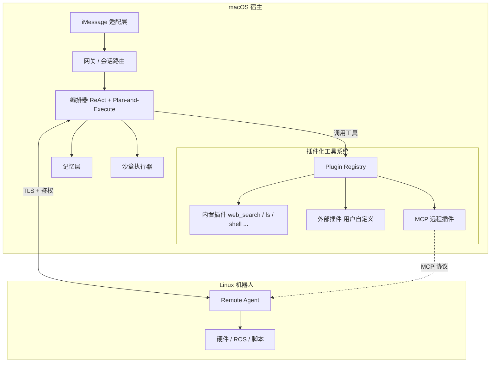
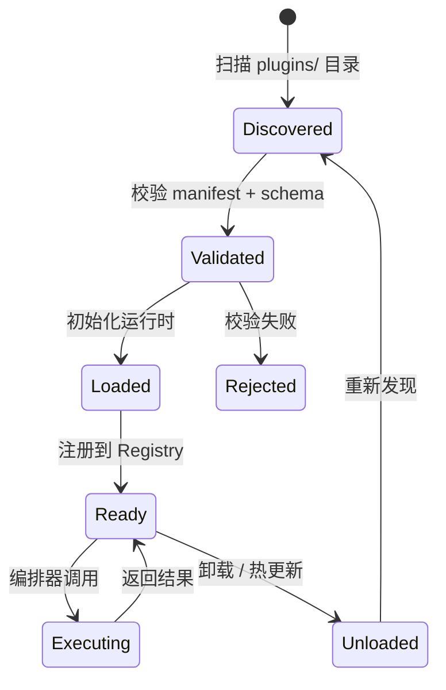

# Cathy — Agent 助手 MVP 架构说明

> **项目工作目录**：本仓库根目录即 `Cathy/`。下文路径均相对于该根目录。

Cathy 是一个类似 OpenClaw 的本地 Agent 助手 MVP：接收 iMessage、规划并执行任务、在沙盒中操作文件、调用工具（网络搜索、Skills 等），具备记忆与上下文，并能与运行在 Linux 机器人上的远程 Agent 通信。编排层采用 **ReAct** 与 **Plan-and-Execute** 相结合的混合架构。

---

## 1. MVP 范围

**MVP 聚焦三件事：**

1. **可靠收发短信**：在 Mac 上常驻服务，以受控方式接入 iMessage（无官方 Bot API；常见方案为监控 `~/Library/Messages/chat.db` 并结合 AppleScript 发送，需处理权限、轮询与系统省电导致的延迟）。
2. **主链路打通**：`入站消息 → 会话与记忆 → 规划/执行 → 工具调用 → 出站回复`。
3. **远程执行面**：Linux 机器人运行轻量 Agent（实际控制设备/ROS/脚本）；Mac 侧仅负责编排与安全策略。

**可后置**：多租户、复杂审批流、完整审计 UI、跨设备同步等。

---

## 2. 技术选型

### 2.1 语言分工

| 层级 | 语言 | 说明 |
|------|------|------|
| 网关 / iMessage 适配 / WebSocket / 配置 | **TypeScript（Node.js）** | 异步 IO 友好、类型清晰，适合长期驻留进程与协议层（建议 Node 22+）。 |
| 编排 / LLM / ReAct·Plan-and-Execute / 工具注册 | **Python** | 与 LangGraph、结构化输出、沙盒内脚本执行衔接自然；若团队更熟悉 Node，也可全栈 TS。 |
| Linux 机器人 Agent | **Python 优先** | 与 ROS2、硬件脚本常见栈一致；极低资源场景可再评估 Go。 |

### 2.2 框架与协议

- **编排**：**LangGraph**（图状态机，便于 Planner / Executor / ReAct 子图）或 **自研有限状态机 + JSON Schema**（MVP 更可控）。
- **工具层**：对齐 **[MCP（Model Context Protocol）](https://modelcontextprotocol.io)**，Skills 可映射为带参数 schema 的 Tool。
- **与 Linux 通信**：MVP 可用 **WebSocket + JSON Schema**；演进为 **gRPC + Protobuf**。
- **沙盒**：**Docker**（每任务/会话 workspace 挂载、超时与资源限制、网络策略）。

---

## 3. 逻辑架构



| 组件 | 职责 |
|------|------|
| **iMessage 适配层** | 读入站（`chat.db` 轮询 / FSEvents + 去抖）、写出站（AppleScript）、白名单与限流。 |
| **网关** | Thread/Chat → `conversation_id`，合并多段消息，系统提示词边界与简单防注入。 |
| **编排器** | 见第 4 节：Plan-and-Execute 外壳 + 步内 ReAct。通过 Plugin Registry 发现和调用工具。 |
| **Plugin Registry** | 插件发现、校验、加载、权限分配、生命周期管理（见第 7 节）。 |
| **记忆层** | 短期窗口、摘要、可选向量检索（见第 5 节）。 |
| **沙盒执行器** | 隔离文件与命令执行（见第 6 节）。 |
| **Remote Agent** | 仅暴露白名单能力（capabilities）；由本机 orchestrator 决定调用时机。 |

---

## 4. ReAct 与 Plan-and-Execute 如何结合

采用 **混合编排**（非二选一）：

1. **Planner（Plan-and-Execute）**  
   - 输入：用户目标、记忆摘要、可用工具列表（含远程 capabilities）。  
   - 输出：**结构化计划**（步骤列表、每步预期工具、成功条件）。  
   - 使用 **JSON Schema / Pydantic** 校验；失败则重试或降级。

2. **Executor**  
   - 按步执行；**每一步内部**使用 **ReAct 小循环**：观察（工具结果/文件变化）→ 思考 → 再调工具或结束该步。  
   - 单步失败时可 **局部重规划**（仅后续子计划）。

3. **建议状态字段**  
   `plan`、`current_step`、`scratchpad`、`pending_tool_calls`、`requires_human`（MVP 可先记录日志）。

4. **iMessage 体验**  
   长任务：先发「已收到，正在处理…」，再发最终结果，避免用户以为卡死。

---

## 5. 记忆与上下文

| 类型 | MVP 实现 | 用途 |
|------|-----------|------|
| **工作记忆** | Redis 或 SQLite：最近 N 轮 + 当前任务状态 | 对话连贯 |
| **会话摘要** | 异步压缩旧对话 | 控制 token |
| **项目规则** | `AGENTS.md` / `CATHY.md` 文件，启动时由 `ContextAssembler` 注入 PROJECT 层 | 偏好、风格、执行约束 |
| **长期记忆（后置）** | 暂不做（向量库 / 事实记忆推迟到后续 Phase） | 跨会话事实知识 |

密钥、机器人策略、允许联系人等应落在 **配置与数据库**，勿依赖模型「口头记住」。

---

## 6. 沙盒与安全

- **每会话或每用户**独立工作目录，挂载进容器；禁止访问宿主敏感路径。  
- **Docker**：非特权、超时、CPU/内存限制、`seccomp`；网络默认关闭或经 **出站代理**（仅允许搜索等固定域名）。  
- **机器人侧**：不向模型开放任意 shell；仅 **白名单 RPC**（如 `move_to`、`capture_image`、`run_safe_script`）。

---

## 7. 插件化工具系统

工具调用是 Agent 能力的核心扩展点。将所有工具统一为 **插件（Plugin）**，通过 Plugin Registry 进行生命周期管理，使系统具备开放式扩展能力。

### 7.1 设计原则

- **统一接口**：无论内置还是外部，所有插件都实现同一个 `ToolPlugin` 接口，编排器不关心实现细节。
- **声明式 Manifest**：每个插件自带 `plugin.yaml`，声明自身的能力、输入输出 schema 和权限需求。
- **最小权限**：插件只能使用 Manifest 中声明且被 Registry 批准的权限（网络、文件系统、shell 等）。
- **热插拔**：支持运行时加载/卸载插件，无需重启编排器。

### 7.2 插件分类

| 类型 | 运行位置 | 示例 | 说明 |
|------|----------|------|------|
| **内置插件** | 本进程 | `web_search`、`file_ops`、`shell_exec`、`current_datetime` | 随系统发布，享有较高信任等级。 |
| **MCP 客户端** | 本进程聚合多个 MCP server | `mcp__*`（来自任意 MCP server） | 复用 `fastmcp.Client`，同 `mcpServers` 配置即可接入。 |
| **本地插件** | 子进程 / Docker | 用户自定义脚本、数据分析工具 | 从 `plugins/` 目录发现，在沙盒中执行。 |
| **MCP 远程插件** | 网络进程 | Linux 机器人能力、第三方 SaaS | 通过 MCP/WebSocket/gRPC 远程调用。 |
| **Skill 插件** | 本进程 | `skills/<name>/` | Skill = Prompt 模板 + 可选工具组合，本质也是一种插件。 |

### 7.3 插件 Manifest（`plugin.yaml`）

```yaml
name: web_search
version: 0.1.0
description: 搜索互联网并返回摘要与引用链接

tools:
  - name: search
    description: 执行网络搜索
    input_schema:
      type: object
      properties:
        query:
          type: string
          description: 搜索关键词
        max_results:
          type: integer
          default: 5
      required: [query]
    output_schema:
      type: object
      properties:
        results:
          type: array
          items:
            type: object
            properties:
              title: { type: string }
              url: { type: string }
              snippet: { type: string }

permissions:
  network: [api.search-provider.com]
  filesystem: none
  shell: false

execution:
  runtime: python           # python | node | docker | mcp
  entrypoint: main.py
  timeout_seconds: 30
  sandbox: true

metadata:
  author: cathy-team
  tags: [search, web]
  trust_level: builtin       # builtin | verified | untrusted
```

### 7.4 Plugin Registry 与生命周期



**Registry 核心职责：**

1. **发现**：启动时扫描 `plugins/` 目录，监听文件变化实现热插拔。
2. **校验**：检查 `plugin.yaml` 格式、schema 完整性、权限声明合理性。
3. **加载**：根据 `runtime` 字段选择执行方式（进程内调用 / 子进程 / Docker / MCP 连接）。
4. **注册**：将每个 tool 的 `name`、`description`、`input_schema` 注入编排器的可用工具列表，供 Planner 使用。
5. **调度**：接收编排器的工具调用请求，路由到对应插件实例，处理超时与重试。
6. **卸载**：支持运行时移除插件，清理资源。

### 7.5 ToolPlugin 接口

```python
from abc import ABC, abstractmethod
from typing import Any

class ToolPlugin(ABC):
    """所有插件的统一接口。"""

    @abstractmethod
    async def initialize(self, config: dict) -> None:
        """加载时调用，接收插件级配置。"""

    @abstractmethod
    async def execute(self, tool_name: str, params: dict) -> Any:
        """
        编排器调用入口。
        - tool_name: manifest 中声明的 tool 名称（一个插件可提供多个 tool）。
        - params: 已经过 input_schema 校验的参数。
        - 返回值须符合 output_schema。
        """

    @abstractmethod
    async def health_check(self) -> bool:
        """Registry 定期探活。"""

    async def shutdown(self) -> None:
        """卸载时调用，释放资源。"""
```

对于 **MCP 远程插件**，框架提供 `McpToolPlugin` 基类，自动将 MCP `tools/list` 映射为本地 tool 注册，`tools/call` 映射为 `execute()`。

### 7.6 编排器如何使用插件

编排器与插件系统的交互协议只有两个操作：

```text
1. list_tools() → [{name, description, input_schema, trust_level, source_plugin}]
   Planner 在生成计划前调用，获取当前可用工具清单。

2. call_tool(name, params) → {result, logs, duration_ms, error?}
   Executor 在 ReAct 循环内调用，Registry 路由到对应插件。
```

编排器 **不直接持有** 任何工具实现的引用，全部经 Registry 中转。这保证了：
- 增删插件不修改编排器代码。
- Registry 可统一做审计日志、限流、权限检查。
- 未来可加「工具审批」中间件（高危操作需人工确认）。

### 7.7 内置插件清单（MVP）

| 插件名 | 提供的 Tools | 权限 | 说明 |
|--------|-------------|------|------|
| `web_search` | `search` | network: 搜索域名 | 网络搜索 + 摘要 + 引用 URL |
| `file_ops` | `read_file`, `write_file`, `list_dir` | filesystem: sandbox only | 沙盒内文件操作 |
| `shell_exec` | `run_command` | shell: true, filesystem: sandbox | 沙盒内执行命令 |
| `mcp` | 动态：从已连接 MCP server 的 `tools/list` 取得，统一加 `mcp__` 前缀 | 视具体 MCP server 而定 | 通过 `fastmcp.Client` 聚合多个 MCP server，启动时发现，运行期 `tools/call` 转发 |
| `robot_remote` | 动态：从 `ListCapabilities` 获取 | network: robot endpoint | MCP 远程插件，代理 Linux 机器人 |

### 7.8 安全模型

```text
                    ┌─────────────────────────────┐
                    │       编排器调用请求          │
                    └──────────────┬──────────────┘
                                   ▼
                    ┌──────────── Registry ────────────┐
                    │  1. 检查 tool 是否存在             │
                    │  2. 校验 params vs input_schema   │
                    │  3. 检查调用方权限 vs 插件权限声明  │
                    │  4. trust_level 门控              │
                    │     untrusted → 需人工确认         │
                    │     verified  → 直接执行           │
                    │     builtin   → 直接执行           │
                    └──────────────┬──────────────┘
                                   ▼
                    ┌─────────────────────────────┐
                    │  按 runtime 隔离执行          │
                    │  python → 子进程 + seccomp    │
                    │  docker → 容器 + 资源限制     │
                    │  mcp    → TLS 远程调用        │
                    └─────────────────────────────┘
```

---

## 8. Skills

Skills 是一种特殊的 Skill 插件：

- **目录结构**：`skills/<name>/SKILL.md`（说明与约束）+ 可选脚本/配置。
- **本质**：Prompt 模板 + 可选的工具组合调用（例如「写博客」Skill 可能组合 `web_search` + `file_ops`）。
- **加载方式**：Plugin Registry 同样扫描 `skills/` 目录，将其注册为 `skill` 类型的 tool。

---

## 9. 与 Linux 机器人 Agent 通信

- **传输**：TLS 1.3 + 设备证书或预共享 Token（MVP）；载荷含 `request_id`、`capability`、`payload`。  
- **流程**：`ListCapabilities` → 写入 Planner 上下文；`ExecuteStep` 返回结构化结果与日志引用。  
- **可靠性**：心跳、重试、幂等 ID；离线时明确回复「设备不可用」。

---

## 10. 仓库目录结构（相对于 `Cathy/`）

```text
Cathy/
  apps/
    gateway/                    # TS：HTTP/WS、配置、与编排进程通信
    imessage-bridge/            # TS 或 AppleScript 封装：chat.db / 发送

  packages/
    protocol/                   # 共享 JSON Schema 或 Protobuf
    plugin-sdk/                 # Python：ToolPlugin 基类、Manifest 校验、测试工具

  services/
    orchestrator/               # Python：LangGraph、Planner / Executor / ReAct
    plugin-registry/            # Python：插件发现、加载、调度、权限检查
    sandbox-runner/             # Python：调用 Docker / 受控子进程
    memory/                     # 可选独立服务；也可并入 orchestrator

  plugins/                      # ← 插件根目录
    builtin/                    #   内置插件（随仓库发布）
      web_search/
        plugin.yaml
        main.py
      file_ops/
        plugin.yaml
        main.py
      shell_exec/
        plugin.yaml
        main.py
      memory/
        plugin.yaml
        main.py
      robot_remote/
        plugin.yaml
        main.py
    community/                  #   社区 / 用户自定义插件（.gitignore 或子仓库）
      example_plugin/
        plugin.yaml
        main.py

  skills/                       # Skill 插件目录
    write_blog/
      SKILL.md
      config.yaml
    summarize/
      SKILL.md

  agents/
    linux-robot/                # Python：WS/gRPC 服务端 + 实际能力实现

  infra/
    docker-compose.yml          # 编排器、Redis、（可选）向量库

  ARCHITECTURE.md               # 本文档
```

---

## 11. 风险与合规（架构预留）

- **iMessage**：依赖 Mac、系统权限与非公开存储行为；文档中明确 **个人/受控环境**，并强制 **联系人白名单**。  
- **安全**：「发消息」「机器人运动」属高敏感能力；MVP 即引入 **工具分级** 与 **默认拒绝**。  
- **可观测性**：结构化日志（plan、每步 tool、每次 remote call），便于后续审计与 UI。

---

## 12. 小结

| 维度 | 选择 |
|------|------|
| 项目根目录 | **`Cathy/`** |
| Mac 侧 | TypeScript 网关 + Python 编排（或全 TS） |
| 机器人侧 | Python Remote Agent |
| 编排 | Plan-and-Execute 外壳 + 步内 ReAct |
| 工具系统 | **插件化**：统一 `ToolPlugin` 接口 + Plugin Registry + `plugin.yaml` 声明式 Manifest |
| 插件类型 | 内置（builtin）、本地（community）、MCP 远程、Skill |
| 协议 | MCP；远程 WebSocket（MVP）→ gRPC（演进） |
| 执行隔离 | Docker + 白名单 RPC（机器人） |

后续实现时可在此文档基础上增加 `README.md`（安装与权限）、`packages/plugin-sdk/` 中的 SDK 文档与示例插件，以及 `protocol/` 的 schema 版本记录。
