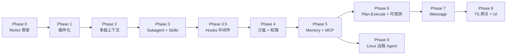

# CathyAgent — MVP 实施路线图（Vibe Coding 版）

> 工作空间：`CathyAgent/`
> 配套文档：`ARCHITECTURE.md`（设计目标态）、本文（实施分阶段计划）
> 设计基调：借鉴 **Claude Code** 的 agent 框架，主干极简，复杂度沉到工具与上下文层。

---

## 0. 总原则

### 0.1 已确认的关键决策

| 议题 | 决策 |
|------|------|
| MVP 语言 | **全 Python** 跑通 harness 层；客户端（含 iMessage 与 UI）后置，再用 **TypeScript** 实现 |
| 编排范式 | MVP 用 **single-loop ReAct**，Plan-and-Execute 推迟到 Phase 7 |
| Subagent | **早做**（Phase 3 即引入），用作上下文压缩与并行探索的核心杠杆 |
| iMessage / 客户端 UI | **放到最后**，不阻塞 harness 层迭代 |
| 配置 schema | 统一为 `LLM_API:` 列表 + `${ENV}` 占位（与 `AgentTest/` 对齐）|
| 工作空间 | 项目根 = `CathyAgent/`（`ARCHITECTURE.md` 中 `Cathy/` 路径须同步更新） |

### 0.2 Claude Code 哲学映射

| Claude Code 设计 | CathyAgent 落地方式 |
|---|---|
| Tool 是唯一抽象 | Skill / Subagent / Memory / MCP **全部**走 `list_tools()` + `call_tool()` |
| Single-loop ReAct | `agent.py` 主循环只做：调 LLM → 执行 tool_calls → 写回 → 循环 |
| Subagent = Task tool | 子 agent 注册为 `task` 工具，复用主循环代码递归执行 |
| Skills = Markdown | `skills/<name>/SKILL.md` 自动注册为 tool；调用 = 创建带 SKILL.md 的 subagent |
| 多级上下文 | System / Project（`AGENTS.md`）/ Skill / Session / Scratchpad 五层装配 |
| 权限分级 | `trust_level`：builtin → 直接 / verified → 审计 / untrusted → 提权确认 |
| Hooks | **Phase 3.5** 单独实现 8 类事件 hook（含 `PreToolUse` / `PostToolUse` / `UserPromptSubmit` / `Stop` / `SubagentStop` / `PreCompact` 等），双后端：Python 反射 + Command 子进程（兼容 `.claude/settings.json`） |

---

## 1. 分阶段路线图

每个 Phase 都满足「**能跑通、能演示**」，按当前节奏估算 0.5–2 天 / Phase。

### Phase 0｜骨架与 ReAct 主循环（最小闭环）

**目标**：把 `AgentTest/custom.py` 的核心思想沉淀为可扩展的 harness 骨架。

**做：**
- 项目骨架（在 `CathyAgent/` 下）：
  ```
  cathy/
    __init__.py
    agent.py           # ReAct 主循环
    config.py          # 配置加载（统一 LLM_API schema）
    llm.py             # OpenAI 兼容客户端封装
    cli.py             # python -m cathy 入口
    tools/
      __init__.py
      base.py          # Tool 基类 + 注册表（极简版）
      web_search.py    # 搬运 AgentTest/custom.py 已验证逻辑
      read_file.py     # 仅读，路径限制在 cwd 下
  ```
- 工具协议：固定 OpenAI function-calling JSON。
- 主循环伪代码：
  ```text
  loop:
    resp = llm.chat(messages, tools=registry.openai_schemas())
    if resp.tool_calls:
        for tc in resp.tool_calls:
            messages += registry.call(tc.name, tc.args)
        continue
    return resp.content
  ```
- 入口：CLI REPL，不接 iMessage。

**验收**：CLI 中提问"搜一下今天 AI 新闻并总结成 3 条要点"，能完整跑出含来源链接的中文回答。

**暂缓**：Plugin Manifest、沙盒、记忆持久化、Skill。

---

### Phase 1｜插件化（Plugin Registry + Manifest）

**目标**：把 Phase 0 硬编码的工具改造为声明式插件。

**做：**
- 落地 `ARCHITECTURE.md §7.5` 的 `ToolPlugin` 接口（**同步版**先行，async 后置）。
- `plugin.yaml` 解析：name / version / tools[].input_schema / permissions / execution.runtime。
- `PluginRegistry`：
  - 启动时扫描 `plugins/builtin/`。
  - jsonschema 校验 manifest 格式 + 工具入参 schema。
  - 暴露 `list_tools()` / `call_tool(name, params)`。
- 把 Phase 0 的工具迁移到 `plugins/builtin/{web_search,file_ops}/`，新增 `write_file`、`list_dir`。
- 主循环只通过 Registry 访问工具，**不再持有任何工具实现引用**。

**验收**：删除 / 新增一个 `plugins/builtin/foo/` 后重启，工具列表自动变化；schema 不匹配的调用被 Registry 拦截并返回结构化错误给模型。

**暂缓**：热插拔（文件监听）、子进程 / Docker runtime、trust_level 审批。

---

### Phase 2｜会话与多级上下文（Context v1）

**目标**：从单 messages 列表升级为可组合、可持久化的多层上下文。

**做：**
- `Session` / `Conversation` 抽象：`session_id`、`messages`、`scratchpad`、`metadata`。
- 持久化：SQLite（两张表 `sessions` / `messages` 起步），CLI 支持 `--session <id>` 续聊。
- **多级上下文装配（核心）**：
  | 层级 | 内容 | 来源 |
  |------|------|------|
  | System | 角色、工具调用规则 | 内置 |
  | Project | 项目级长期规则 | `./AGENTS.md` 或 `./CATHY.md`（若存在） |
  | Skill | 当前激活的 SKILL.md 内容 | Phase 3 起注入 |
  | Session | 历史消息 | SQLite |
  | Scratchpad | 当前任务工具结果 / subagent 返回 | 内存 |
- `ContextAssembler`：按优先级拼接 + token 预算（先硬截断，摘要 Phase 7 再做）。

**验收**：项目根放 `AGENTS.md` 写一条"回答必须用中文 + 引用必须给链接"，新会话立即遵守；同一 `--session` 重启后历史不丢。

**暂缓**：异步会话摘要、向量长期记忆。

---

### Phase 3｜Subagent + Skills（能力组合 & 上下文压缩）

> 本 Phase 提前到第 3 位，作为 Claude Code 风格架构的关键杠杆。

**目标**：让 agent 能派生 subagent、加载 skill，并实现父子上下文隔离。

**做：**
- **Subagent = `task` 内置工具**（Claude Code 同款）：
  - 入参：`description` / `prompt` / 可选 `tools`（白名单子集）/ `readonly`（默认 true）。
  - 实现：在 subagent 容器内**新建独立 messages 列表**，递归复用 `agent.py` 主循环。
  - **只把最终回复**返回给父 agent —— 这是上下文压缩的关键。
  - 父 scratchpad 不向下游传，子工具结果不污染父上下文。
- **Skills**：
  - 扫描 `skills/<name>/SKILL.md`，每个 skill 注册为一个 tool。
  - 描述 = SKILL.md frontmatter（或前 N 行）。
  - 调用 = 创建一个**预装载 SKILL.md 全文**的 subagent，等价于 Claude Code 的 skill 机制。
- 内置示例 skill：`summarize`（处理超长文档）、`write_blog`（组合 web_search + write_file）。

**验收**：
- 主 agent 收到 10K+ 字文档时，调用 `summarize` skill，**主上下文只看到 200 字摘要**而非全文。
- `task` 工具能并行/串行（先串行）派生子 agent 完成子任务并合并结果。

**暂缓**：subagent 并行调度、subagent 之间互相通信。

---

### Phase 3.5｜Hooks 中间件（机制层）

**目标**：在主循环和 subagent 关键节点埋统一的 hook 接入点，让审计 / 安全 / 流程改写有统一入口。本阶段只做**机制**，具体安全策略在 Phase 4 落地。

**做：**
- 新增包 `cathy/hooks/`：`events.py` / `manager.py` / `runners.py` / `builtin.py`。
- 8 类事件埋点（与 Claude Code 协议一致）：
  | 事件 | 埋点位置 | 可改写 |
  |---|---|---|
  | `SessionStart` | `cli.main` 拿到 session 之后 | inject_context |
  | `UserPromptSubmit` | `Agent.run` 入口、user_msg 持久化前 | rewrite_user_input / block / inject_context |
  | `PreToolUse` | `Agent.run` 中 `tools.call()` 之前 | rewrite_params / block |
  | `PostToolUse` | `Agent.run` 中 `tools.call()` 之后 | inject_context（拼进 result） |
  | `Stop` | final 分支 return 之前 | rewrite_final_answer / block（强制再循环） |
  | `SubagentStop` | `SubagentToolPlugin.execute` 之后 | rewrite_final_answer |
  | `PreCompact` | `ContextAssembler._fit_to_budget` 入口 | 自定义压缩策略 |
  | `Notification` | 任意位置主动调 | 路由到外部（IM / 邮件） |
- 双执行后端：
  - `type: python` —— `target: "module:func"` 反射调用，零开销，支持类型化 `HookEvent → HookDecision`。
  - `type: command` —— stdin 收 JSON / stdout 返决策 / `exit 2 = block`，**100% 兼容 `.claude/settings.json` 形态**，CC 用户脚本可直接迁移。
- `HookDecision` 字段：`block` / `block_reason` / `inject_context` / `rewrite_params` / `rewrite_user_input` / `rewrite_final_answer` / `extra`。
- 配置：`config/config.yaml` 新增 `HOOKS:` 段；自动合并项目根 `.claude/settings.json` 若存在。
- 内置 hook 三件套（演示性，非安全策略）：
  - `audit_log` —— `PostToolUse` 把每次调用写到 `data/audit.jsonl`（含 session / tool / params / result / latency_ms）
  - `block_dangerous_paths` —— `PreToolUse` 拦截 `write_file` 写到 `~/.ssh` / `/etc/` 等
  - `strip_secrets` —— `UserPromptSubmit` 用 regex 剔除 `sk-...` / `api_key=...` 之类敏感字符串

**验收**：
- 配置 `block_dangerous_paths` 后，让 LLM 试图 `write_file('/etc/foo', ...)`，工具返回结构化阻断错误，model 能 self-correct。
- `data/audit.jsonl` 每次 tool call 一行；`tail -f` 能实时看到主 agent 与子 agent 的全部调用。
- `python tools/cc_hook.py < event.json` 这种 CC 风格脚本被加载执行后行为正确（exit 2 等价 `block=True`）。
- Phase 0–3 全部既有测试不破坏；新增 hooks 单测 ≥ 5 条（matcher / 串联合并 / block 短路 / 超时 / Python+Command 混用）。

**暂缓**：可视化 hook 配置 UI（Phase 8）；远程 hook（HTTP webhook）；并发 hook 执行。

---

### Phase 4｜沙盒与权限分级（安全底座）

**目标**：让文件写入、shell 执行等危险操作可控。

**做：**
- **工作空间**：每个 session 一个 `workspaces/<session_id>/`，文件类工具的路径**强制 chroot**（`os.path.realpath` 校验）。
- 新增 `shell_exec` 工具：`subprocess` + 白名单参数 + 超时；`runtime: docker` 留接口占位但**不真做**。
- **trust_level 三档**（对齐 Claude Code 的 ask/allow/deny）：
  | trust_level | 行为 |
  |---|---|
  | `builtin` | 直接执行 |
  | `verified` | 直接执行 + 审计日志 |
  | `untrusted` | CLI 弹"允许 / 拒绝 / 始终允许"提示 |
- 在 Phase 3.5 的 hook 系统上注入安全策略 builtin hooks：
  - `permission_gate`（PreToolUse）：按 `trust_level` 决定 allow / audit / ask（`untrusted` 弹 CLI 提示）
  - `workspace_chroot`（PreToolUse）：file_ops 类工具路径强制校验在 `workspaces/<session_id>/` 内
  - `tool_audit`（PostToolUse）：把每次调用写入 `data/audit.jsonl`（与 Phase 3.5 的 `audit_log` 复用同一实现）

**验收**：
- 沙盒外路径调用 `write_file` 直接报错。
- 标记为 `untrusted` 的插件每次调用前都需用户确认。
- 所有工具调用产出结构化审计日志。

**暂缓**：Docker runtime 实际落地、seccomp、出站网络代理。

---

### Phase 5｜Memory & MCP（长期能力 + 外部生态）

**目标**：补齐长期记忆，打通 MCP 生态。

**做：**
- **Memory 插件**：
  - `query_memory` / `save_memory` 两个工具。
  - 存储：SQLite + `sqlite-vec`（最轻量，无需独立向量服务）。
  - 触发策略：写入由模型自行决定；查询由 ContextAssembler 在 Phase 2 的 Session 层之上注入相关记忆。
- **MCP 客户端**：
  - 实现 `McpToolPlugin` 基类（`ARCHITECTURE.md §7.5` 已设计）。
  - `config.yaml` 新增 `mcp_servers:` 段，启动时拉起 stdio / SSE 任选其一先做。
  - `tools/list` 自动映射为本地 tool，`tools/call` 映射为 `execute()`。

**验收**：
- 用户告知"我喜欢简洁回答"，下一会话仍生效。
- `config.yaml` 加一个公开 MCP server，agent 自动多出几个工具且可调用。

---

### Phase 6｜Plan-and-Execute & 可观测性

**目标**：提升复杂任务稳定性，补齐审计能力。

**做：**
- 在 single-loop 外**叠一层可选** Planner：
  - 触发条件：用户显式 `/plan` 指令，或检测到任务步数 > 阈值。
  - Planner 输出结构化 plan（pydantic 校验），落到 scratchpad。
  - Executor 仍用 Phase 0 的 ReAct 主循环执行每步，单步失败做局部重规划。
- 异步会话摘要：旧消息 → 摘要 → 替换原文，控制 token 预算。
- 可观测性：结构化 JSONL 日志（plan / 每步 tool / 每次 remote call），先输出文件，UI 后置。

**验收**：跨 5+ 步的任务能稳定完成，且日志可追溯到每一步的输入输出。

---

### Phase 7｜iMessage 接入（Mac 入口）

> 客户端层第一步：把 CLI 入口扩展为 iMessage。

**目标**：在 Mac 上常驻服务，通过 iMessage 收发消息。

**做：**
- `imessage_bridge.py`（仍是 Python，纳入 harness）：
  - 入站：增量轮询 `~/Library/Messages/chat.db`（按 `ROWID > last_seen`），10 秒级延迟可接受。
  - 出站：`subprocess` 调 AppleScript `tell application "Messages" to send ...`。
  - 联系人白名单（手机号 / Apple ID 列表写在 `config.yaml`）。
- `Router`：`(chat_guid, sender)` → `session_id`，复用 Phase 2 的 Session。
- 长任务体验：先发"已收到，正在处理…"心跳消息，避免用户以为卡死。

**验收**：手机给 Mac 发"搜一下苹果今晚发布会要点"，2 分钟内收到带链接的中文回复。

**暂缓**：群聊路由、附件、emoji 反应。

---

### Phase 8｜TypeScript 客户端 / 网关

**目标**：把入口层从 Python 迁出，对齐 `ARCHITECTURE.md` 目标态。

**做：**
- `apps/gateway/`（TS，Node 22+）：
  - HTTP / WS 接口暴露给前端。
  - 与 Python `orchestrator` 通过本地 IPC（gRPC 或 WebSocket + JSON Schema）通信。
  - 配置中心化、鉴权、限流。
- `apps/imessage-bridge/`（TS）：把 Phase 7 的 Python 实现重写为 TS（或继续保留 Python，仅在网关之后）。
- 前端 UI：会话列表 / 工具调用可视化 / 审批面板（Claude Code 风格）。

**验收**：浏览器打开本地 UI，能与 Python harness 完整对话；所有 Phase 0–6 能力在新入口下保持可用。

---

### Phase 9｜Linux 远程 Agent

**目标**：打通机器人侧。

**做：**
- Linux 侧用 Python 起一个 **MCP server**（不另造协议）。
- 暴露白名单 capabilities：`move_to`、`capture_image`、`run_safe_script`。
- Mac 侧通过 Phase 5 的 MCP 客户端连接，能力自动出现在 `list_tools()` 中。
- TLS 1.3 + 设备证书 / 预共享 Token。

**验收**：从 iMessage 或 UI 发"让机器人前进 1 米并拍一张照"，端到端完成。

---

## 2. Phase 0 当天可执行清单

如果今天就要开干，**只做下面 5 步**，跑通即收工：

1. **配置统一**：把 `CathyAgent/config/config.yaml` 改为 `LLM_API:` 列表 + `${ENV}` 占位形式（与 `AgentTest/` 一致）。
2. **建包骨架**：
   ```text
   CathyAgent/
     cathy/
       __init__.py
       agent.py
       config.py
       llm.py
       cli.py
       tools/
         __init__.py
         base.py
         web_search.py
         read_file.py
     pyproject.toml         # 或 requirements.txt
   ```
3. **搬运主循环**：把 `AgentTest/custom.py` 的 ReAct 循环抽到 `cathy/agent.py`，工具调用改走 `cathy/tools/base.py` 的注册表。
4. **两个工具落地**：
   - `web_search`（直接搬运已验证的 Tavily 实现）。
   - `read_file`（仅读，`Path.resolve()` 限制在 cwd 子树内）。
5. **CLI 跑通**：`python -m cathy` 进入 REPL，演示一轮"搜索 + 引用 + 中文回答"。

**严禁**在 Phase 0 碰：plugin manifest、subagent、SQLite、iMessage、沙盒。

---

## 3. 阶段依赖关系图



> Phase 9 依赖 Phase 5（MCP 客户端），可与 Phase 6/7/8 并行。
> Phase 6 的"可观测性"在 Phase 3.5 之后实现量减半（结构化 JSONL 日志直接由 PostToolUse hook 产出）。

---

## 4. 待办与悬而未决

- [ ] `ARCHITECTURE.md` 中所有 `Cathy/` 路径同步替换为 `CathyAgent/`。
- [ ] 决定 `pyproject.toml` 用 `uv` / `poetry` / 纯 `pip + venv` 哪一种。
- [ ] 决定 LLM 默认模型（`qwen3.5-plus` / `qwen-max` / 其他）以及是否多模型路由（按 role 分工）。
- [ ] iMessage 阶段是否需要群聊支持（影响 Router 设计）。

---

## 5. 小结

| 维度 | MVP 选择 |
|------|----------|
| 工作空间 | `CathyAgent/` |
| 语言 | Python（harness 全栈）→ TS（客户端层 Phase 8 起） |
| 编排 | Single-loop ReAct（Plan-Execute 后置） |
| 关键杠杆 | Subagent 早做（Phase 3），上下文压缩与能力组合都靠它 |
| 中间件 | Hooks 在 Phase 3.5 落地，作为后续安全 / 审计 / 改写的统一入口 |
| 入口顺序 | CLI（P0）→ iMessage（P7）→ Web UI（P8） |
| 工具协议 | OpenAI function-calling → Plugin Manifest → MCP |
| 安全 | trust_level 三档 + sandbox chroot；Docker / seccomp 后置 |
