# CathyAgent — MVP 实施路线图（Vibe Coding 版）

> 工作空间：`CathyAgent/`
> 配套文档：`ARCHITECTURE.md`（设计目标态）、本文（实施分阶段计划）
> 设计基调：借鉴 **Claude Code** 的 agent 框架，主干极简，复杂度沉到工具与上下文层。

---

## 0. 总原则

### 0.1 已确认的关键决策

| 议题 | 决策 |
|------|------|
| MVP 语言 | **全 Python** 跑通 harness 层；客户端（含 iMessage 与 UI）后置，再用 **TypeScript** 实现 |
| 编排范式 | MVP 用 **single-loop ReAct**，Plan-and-Execute 推迟到 Phase 7 |
| Subagent | **早做**（Phase 3 即引入），用作上下文压缩与并行探索的核心杠杆 |
| iMessage / 客户端 UI | **放到最后**，不阻塞 harness 层迭代 |
| 配置 schema | 统一为 `LLM_API:` 列表 + `${ENV}` 占位（与 `AgentTest/` 对齐）|
| 工作空间 | 项目根 = `CathyAgent/`（`ARCHITECTURE.md` 中 `Cathy/` 路径须同步更新） |

### 0.2 Claude Code 哲学映射

| Claude Code 设计 | CathyAgent 落地方式 |
|---|---|
| Tool 是唯一抽象 | Skill / Subagent / Memory / MCP **全部**走 `list_tools()` + `call_tool()` |
| Single-loop ReAct | `agent.py` 主循环只做：调 LLM → 执行 tool_calls → 写回 → 循环 |
| Subagent = Task tool | 子 agent 注册为 `task` 工具，复用主循环代码递归执行 |
| Skills = Markdown | `skills/<name>/SKILL.md` 自动注册为 tool；调用 = 创建带 SKILL.md 的 subagent |
| 多级上下文 | System / Project（`AGENTS.md`）/ Skill / Session / Scratchpad 五层装配 |
| 权限分级 | `trust_level`：builtin → 直接 / verified → 审计 / untrusted → 提权确认 |
| Hooks | **Phase 3.5** 单独实现 8 类事件 hook（含 `PreToolUse` / `PostToolUse` / `UserPromptSubmit` / `Stop` / `SubagentStop` / `PreCompact` 等），双后端：Python 反射 + Command 子进程（兼容 `.claude/settings.json`） |

---

## 1. 分阶段路线图

每个 Phase 都满足「**能跑通、能演示**」，按当前节奏估算 0.5–2 天 / Phase。

### Phase 0｜骨架与 ReAct 主循环（最小闭环）

**目标**：把 `AgentTest/custom.py` 的核心思想沉淀为可扩展的 harness 骨架。

**做：**
- 项目骨架（在 `CathyAgent/` 下）：
  ```
  cathy/
    __init__.py
    agent.py           # ReAct 主循环
    config.py          # 配置加载（统一 LLM_API schema）
    llm.py             # OpenAI 兼容客户端封装
    cli.py             # python -m cathy 入口
    tools/
      __init__.py
      base.py          # Tool 基类 + 注册表（极简版）
      web_search.py    # 搬运 AgentTest/custom.py 已验证逻辑
      read_file.py     # 仅读，路径限制在 cwd 下
  ```
- 工具协议：固定 OpenAI function-calling JSON。
- 主循环伪代码：
  ```text
  loop:
    resp = llm.chat(messages, tools=registry.openai_schemas())
    if resp.tool_calls:
        for tc in resp.tool_calls:
            messages += registry.call(tc.name, tc.args)
        continue
    return resp.content
  ```
- 入口：CLI REPL，不接 iMessage。

**验收**：CLI 中提问"搜一下今天 AI 新闻并总结成 3 条要点"，能完整跑出含来源链接的中文回答。

**暂缓**：Plugin Manifest、沙盒、记忆持久化、Skill。

---

### Phase 1｜插件化（Plugin Registry + Manifest）

**目标**：把 Phase 0 硬编码的工具改造为声明式插件。

**做：**
- 落地 `ARCHITECTURE.md §7.5` 的 `ToolPlugin` 接口（**同步版**先行，async 后置）。
- `plugin.yaml` 解析：name / version / tools[].input_schema / permissions / execution.runtime。
- `PluginRegistry`：
  - 启动时扫描 `plugins/builtin/`。
  - jsonschema 校验 manifest 格式 + 工具入参 schema。
  - 暴露 `list_tools()` / `call_tool(name, params)`。
- 把 Phase 0 的工具迁移到 `plugins/builtin/{web_search,file_ops}/`，新增 `write_file`、`list_dir`。
- 主循环只通过 Registry 访问工具，**不再持有任何工具实现引用**。

**验收**：删除 / 新增一个 `plugins/builtin/foo/` 后重启，工具列表自动变化；schema 不匹配的调用被 Registry 拦截并返回结构化错误给模型。

**暂缓**：热插拔（文件监听）、子进程 / Docker runtime、trust_level 审批。

---

### Phase 2｜会话与多级上下文（Context v1）

**目标**：从单 messages 列表升级为可组合、可持久化的多层上下文。

**做：**
- `Session` / `Conversation` 抽象：`session_id`、`messages`、`scratchpad`、`metadata`。
- 持久化：SQLite（两张表 `sessions` / `messages` 起步），CLI 支持 `--session <id>` 续聊。
- **多级上下文装配（核心）**：
  | 层级 | 内容 | 来源 |
  |------|------|------|
  | System | 角色、工具调用规则 | 内置 |
  | Project | 项目级长期规则 | `./AGENTS.md` 或 `./CATHY.md`（若存在） |
  | Skill | 当前激活的 SKILL.md 内容 | Phase 3 起注入 |
  | Session | 历史消息 | SQLite |
  | Scratchpad | 当前任务工具结果 / subagent 返回 | 内存 |
- `ContextAssembler`：按优先级拼接 + token 预算（先硬截断，摘要 Phase 7 再做）。

**验收**：项目根放 `AGENTS.md` 写一条"回答必须用中文 + 引用必须给链接"，新会话立即遵守；同一 `--session` 重启后历史不丢。

**暂缓**：异步会话摘要、向量长期记忆。

---

### Phase 3｜Subagent + Skills（能力组合 & 上下文压缩）

> 本 Phase 提前到第 3 位，作为 Claude Code 风格架构的关键杠杆。

**目标**：让 agent 能派生 subagent、加载 skill，并实现父子上下文隔离。

**做：**
- **Subagent = `task` 内置工具**（Claude Code 同款）：
  - 入参：`description` / `prompt` / 可选 `tools`（白名单子集）/ `readonly`（默认 true）。
  - 实现：在 subagent 容器内**新建独立 messages 列表**，递归复用 `agent.py` 主循环。
  - **只把最终回复**返回给父 agent —— 这是上下文压缩的关键。
  - 父 scratchpad 不向下游传，子工具结果不污染父上下文。
- **Skills**：
  - 扫描 `skills/<name>/SKILL.md`，每个 skill 注册为一个 tool。
  - 描述 = SKILL.md frontmatter（或前 N 行）。
  - 调用 = 创建一个**预装载 SKILL.md 全文**的 subagent，等价于 Claude Code 的 skill 机制。
- 内置示例 skill：`summarize`（处理超长文档）、`write_blog`（组合 web_search + write_file）。

**验收**：
- 主 agent 收到 10K+ 字文档时，调用 `summarize` skill，**主上下文只看到 200 字摘要**而非全文。
- `task` 工具能并行/串行（先串行）派生子 agent 完成子任务并合并结果。

**暂缓**：subagent 并行调度、subagent 之间互相通信。

---

### Phase 3.5｜Hooks 中间件（机制层）

**目标**：在主循环和 subagent 关键节点埋统一的 hook 接入点，让审计 / 安全 / 流程改写有统一入口。本阶段只做**机制**，具体安全策略在 Phase 4 落地。

**做：**
- 新增包 `cathy/hooks/`：`events.py` / `manager.py` / `runners.py` / `builtin.py`。
- 8 类事件埋点（与 Claude Code 协议一致）：
  | 事件 | 埋点位置 | 可改写 |
  |---|---|---|
  | `SessionStart` | `cli.main` 拿到 session 之后 | inject_context |
  | `UserPromptSubmit` | `Agent.run` 入口、user_msg 持久化前 | rewrite_user_input / block / inject_context |
  | `PreToolUse` | `Agent.run` 中 `tools.call()` 之前 | rewrite_params / block |
  | `PostToolUse` | `Agent.run` 中 `tools.call()` 之后 | inject_context（拼进 result） |
  | `Stop` | final 分支 return 之前 | rewrite_final_answer / block（强制再循环） |
  | `SubagentStop` | `SubagentToolPlugin.execute` 之后 | rewrite_final_answer |
  | `PreCompact` | `ContextAssembler._fit_to_budget` 入口 | 自定义压缩策略 |
  | `Notification` | 任意位置主动调 | 路由到外部（IM / 邮件） |
- 双执行后端：
  - `type: python` —— `target: "module:func"` 反射调用，零开销，支持类型化 `HookEvent → HookDecision`。
  - `type: command` —— stdin 收 JSON / stdout 返决策 / `exit 2 = block`，**100% 兼容 `.claude/settings.json` 形态**，CC 用户脚本可直接迁移。
- `HookDecision` 字段：`block` / `block_reason` / `inject_context` / `rewrite_params` / `rewrite_user_input` / `rewrite_final_answer` / `extra`。
- 配置：`config/config.yaml` 新增 `HOOKS:` 段；自动合并项目根 `.claude/settings.json` 若存在。
- 内置 hook 三件套（演示性，非安全策略）：
  - `audit_log` —— `PostToolUse` 把每次调用写到 `data/audit.jsonl`（含 session / tool / params / result / latency_ms）
  - `block_dangerous_paths` —— `PreToolUse` 拦截 `write_file` 写到 `~/.ssh` / `/etc/` 等
  - `strip_secrets` —— `UserPromptSubmit` 用 regex 剔除 `sk-...` / `api_key=...` 之类敏感字符串

**验收**：
- 配置 `block_dangerous_paths` 后，让 LLM 试图 `write_file('/etc/foo', ...)`，工具返回结构化阻断错误，model 能 self-correct。
- `data/audit.jsonl` 每次 tool call 一行；`tail -f` 能实时看到主 agent 与子 agent 的全部调用。
- `python tools/cc_hook.py < event.json` 这种 CC 风格脚本被加载执行后行为正确（exit 2 等价 `block=True`）。
- Phase 0–3 全部既有测试不破坏；新增 hooks 单测 ≥ 5 条（matcher / 串联合并 / block 短路 / 超时 / Python+Command 混用）。

**暂缓**：可视化 hook 配置 UI（Phase 8）；远程 hook（HTTP webhook）；并发 hook 执行。

---

### Phase 4｜可控执行（先 shell_exec，再 sandbox，再权限策略）

**目标**：先把 `shell_exec` 作为一等工具接入，再逐步把文件/命令执行放进可控沙盒；避免“一上来做重隔离”拖慢迭代。

#### Phase 4A｜`shell_exec` 工具先落地（功能闭环）

**做：**
- 新增 `plugins/builtin/shell_exec/`（`plugin.yaml` + `main.py`），工具签名：
  - 入参：`command`, `cwd?`, `timeout_sec?`, `env_allowlist?`
  - 出参：`stdout`, `stderr`, `exit_code`, `timed_out`
- 最小安全栏（非沙盒）：禁 `sudo` / 禁多行命令 / 默认 10s 超时 / 输出长度截断。
- 与 Phase 3.5 hooks 打通（4A 剩余）：
  - `PreToolUse`：新增 `block_dangerous_shell_commands`，在 hook 层统一拦截高危命令（`rm -rf /`、fork bomb、提权模式）；插件内 `_validate_command` 保留为兜底。
  - `PostToolUse`：审计日志补齐 shell 关键字段（`command`, `exit_code`, `timed_out`, `latency_ms`）。

**验收：**
- Agent 能调用 `shell_exec("python -V")` 并返回结构化结果。
- 超时命令被终止，返回 `timed_out=true`。
- 危险命令被 `PreToolUse` hook 拦截并回灌模型自纠（不仅依赖插件内校验）。

#### Phase 4B｜Sandbox 适配层（隔离闭环）

**做：**
- 抽象 `SandboxExecutor` 接口（`run(cmd, cwd, env, limits) -> result`），`shell_exec`/`file_ops` 均走这层或共享同一 `resolve_in_workspace` 约束。
- 先实现 `seatbelt`（mac，`py-sandboxrt`）+ `local_restricted`（兜底）两层，保持后端可插拔。
- 工作空间隔离（本阶段重点）：每个 session 固定 `workspaces/<session_id>/`。
  - `shell_exec` 的 `cwd` 必须在该目录内；
  - `file_ops` 的 `root` 必须切到该目录（跨 session 路径直接拒绝）。
- Session -> Workspace 绑定：在 `cli/main` 拿到 session 后注入 runtime（而不是静态全局 workspace）。
- 资源限制：超时、输出长度、网络开关（默认关）；进程数/内存上限后置到 4C/后续。

**方案说明（已定）：**
- 不采用 `nsjail` 路线；当前目标是 mac 本地可用、可插拔扩展。
- Cursor / Claude Code 同类能力在 CathyAgent 中分层放置：
  - 4B 做 runtime 隔离（sandbox + workspace）
  - 4C 做策略治理（permission/audit/ask/deny）

**验收：**
- 任何 `shell_exec`/`write_file` 越出 `workspaces/<session_id>/` 直接失败。
- 同一进程创建两个 session，A 会话无法读写 B 会话目录。
- `SANDBOX.backend` 在 `seatbelt` / `local_restricted` 间可切换，业务层无需改代码。

#### Phase 4C｜权限策略（治理闭环）

**做：**
- 在 Phase 3.5 hook 之上挂三件套：
  - `permission_gate`（PreToolUse）：按 `trust_level` 决定 allow/audit/ask/deny
  - `workspace_guard`（PreToolUse）：二次校验路径与 cwd
  - `tool_audit`（PostToolUse）：统一 JSONL 审计（命令 + 文件操作）
- `trust_level` 策略：
  | trust_level | 默认行为 |
  |---|---|
  | `builtin` | allow |
  | `verified` | allow + audit |
  | `untrusted` | ask（CLI）或 deny（无交互模式） |

**验收：**
- `untrusted` 工具在交互模式必经审批；非交互模式默认 deny。
- 审计日志可按 `session_id` 还原完整执行链。

**暂缓**：gVisor / Firecracker 微 VM、远程隔离集群、细粒度网络代理策略、Linux 专用高隔离后端。

---

### Phase 5｜MCP（外部生态）

**目标**：打通 MCP 生态。规则层沿用 Phase 2 的 `AGENTS.md` / `CATHY.md` 项目规则，不另起独立 rule memory 体系。

**做：**
- **项目规则**（已具备，无需新增模块）：
  - 用户在项目根维护 `AGENTS.md` 或 `CATHY.md`，由 `ContextAssembler` 自动作为 PROJECT 层注入 system prompt。
  - 如需个人级规则，把指令写进 `AGENT.extra_system` 或项目 `AGENTS.md`。
- **MCP 客户端**（已实现）：
  - 复用官方 SDK：`fastmcp.Client`（构筑在 `mcp` 官方 Python SDK 之上）。
  - `config.yaml` 新增 `MCP.mcp_servers` 段，结构与 Claude Code 的 `mcpServers` 同构（local stdio：`command/args/env`；remote：`url/headers`）。
  - 实现 `cathy/mcp/`：
    - `McpHub`：后台守护线程承载 asyncio loop；`async with Client(...)` 持长连接；同步方法走 `run_coroutine_threadsafe`。
    - `McpToolPlugin` + `build_mcp_manifest`：把 `tools/list` 映射为带 `mcp__` 前缀的 OpenAI tool schema，注册进 `PluginRegistry`。
    - 优雅降级：`fastmcp` 未安装或启动失败时仅 print 日志，不阻断主流程。

**验收**：
- 在 `AGENTS.md` 写下"回答必须用中文"，新会话立即遵守（Phase 2 已通过，本阶段保持）。
- `config.yaml` 配一个 MCP server，启动后 `[mcp] connected servers=...` 日志可见，工具列表里出现 `mcp__*`，agent 能调用成功（in-memory FastMCP server 集成测试已覆盖）。

#### Phase 5.1｜MCP 安全姿势对齐 CC / Cursor（已完成）

> 背景：Phase 5 主线只把 MCP 接入了，trust 走 `verified=audit`，等于"只记录、不拦截"；
> 而内置 hook 的 matcher 又只对 `write_file` / `shell_exec` 这种字面量生效，`mcp__*`
> 工具实际**绕过**了 Phase 4C 的策略治理。本子阶段把 MCP 工具纳入既有权限/Hook 链路，
> 形态对齐 Claude Code（`mcp__<server>__<tool>` + `permissions` allow/ask/deny）与
> Cursor（`mcpAllowlist`）。

**做：**
- **命名规则**：MCP 工具名由 `mcp__<tool>` 升级为 **`mcp__<server>__<tool>`**；
  - `cathy/mcp/client.py` 新增 `build_outer_tool_name(inner, server_names)`，
    最长 server 前缀优先匹配；单 server / in-memory 测试场景退化为旧形态。
  - `McpHub` 新增 `server_names` 参数；`cli.py` 注入 `mcp_servers.keys()` 列表。
  - `McpToolInfo` 新增 `server_name` 字段，便于审计。
- **Hook matcher 支持 glob**：`cathy/hooks/manager.py` 在原"字面量 / `|` 多段"基础上，
  含 `* ? [ ]` 时走 `fnmatch.fnmatchcase`；`|` 多段每段独立 glob。这样配置可写
  `matcher: "write_file|mcp__fs__write_*"`，把 MCP 工具一并纳入既有保护 hook。
- **`permission_gate` 引入 `mcp_rules`**：`cathy/hooks/builtin.py` 新增
  `_match_mcp_rules(tool, mcp_rules)`，按 **deny → ask → allow** 顺序匹配，仅对
  `mcp__*` 前缀生效，命中后**覆盖** trust_policy 的 action（语义对齐 CC `permissions`
  / Cursor `mcpAllowlist`）。
- **`agent.py` 透传**：PreToolUse 派发的 `meta` 增加 `mcp_rules` 字段。
- **配置示例**（`config/config.yaml`）：
  - `HOOKS.PreToolUse` matcher 用 glob 扩展，复用已有的 `block_dangerous_paths` /
    `block_dangerous_shell_commands` 拦截 MCP 同类工具。
  - `PERMISSION` 段新增 `mcp_rules`：默认 `mcp__fs__delete_*` / `mcp__fs__move_*` deny，
    `mcp__fs__write_*` / `mcp__fs__edit_*` ask，`mcp__fs__read_*` / `mcp__memory__*` /
    `mcp__time__*` allow。

**验收**（已通过）：
- `tests/test_mcp_hub.py` 新增 `BuildOuterToolNameTest` 5 case：带前缀 / 最长前缀
  / 无 server fallback / 无 server names 兼容 / 数字开头补 `t_`。
- `tests/test_hooks_manager.py` 新增 `test_matcher_glob_prefix` 与
  `test_matcher_alternation_with_glob`，验证 `mcp__fs__write_*` 等 glob 正常命中。
- `tests/test_hooks_builtin.py` `PermissionGateTests` 新增 5 case：
  deny 覆盖 audit、ask 非交互拦截、allow 通过、不影响 builtin、deny 优先级高于 allow。
- 现有 14 个新增/修改 case 全部通过；旧测试无 regression（langgraph 缺失导致的
  2 个 ERROR 与本次改动无关）。

**对照 CC / Cursor**：
| 维度 | Claude Code | Cursor | CathyAgent（本阶段） |
|---|---|---|---|
| 工具命名 | `mcp__<server>__<tool>` | `<server>:<tool>` | `mcp__<server>__<tool>` |
| 规则形式 | `permissions: {allow/ask/deny}` | `mcpAllowlist: ["<server>:<tool>"]` | `PERMISSION.mcp_rules: {deny/ask/allow}` |
| 优先级 | deny → ask → allow | allowlist 命中即放行 | deny → ask → allow（覆盖 trust_policy） |
| Glob | `mcp__server__*` 等 | `server:*` / glob | fnmatch glob，hook matcher / mcp_rules 同款 |
| 进程隔离 | 无 | 无（`sandbox.json` 仅管 terminal） | 无（与上述两家持平；Seatbelt 仍只覆盖内置工具） |

**暂缓 / 后续（5.2+）**：
- **MCP 子进程沙盒化**：把 `mcp_servers.<name>.command` 默认包一层 `sandbox-exec`，
  让 server 本身只能访问 `roots`（与本阶段权限治理形成纵深防御）。
- **mcpServers 变更检测**：启动时对配置段做 hash，发生变化要求显式 `--accept-mcp-changes`
  才继续（对齐 Cursor MCPoison/CVE-2025-54136 修复）。
- **env 白名单透传**：`mcp_servers.<name>.env` 默认收敛为白名单，避免子进程读到
  `DEEPSEEK_API_KEY` / `~/.aws/credentials` 等。
- **roots 与 workspace 对齐**：默认从 `SANDBOX.workspace_root` 派生 roots，让 MCP 看到
  的根目录与内置工具一致，避免出现 `/tmp` 这种"宽于 workspace"的 root。

---

### Phase 6｜Plan-and-Execute & 可观测性

**目标**：提升复杂任务稳定性，补齐审计能力。

**做：**
- 在 single-loop 外**叠一层可选** Planner：
  - 触发条件：用户显式 `/plan` 指令，或检测到任务步数 > 阈值。
  - Planner 输出结构化 plan（pydantic 校验），落到 scratchpad。
  - Executor 仍用 Phase 0 的 ReAct 主循环执行每步，单步失败做局部重规划。
- 异步会话摘要：旧消息 → 摘要 → 替换原文，控制 token 预算。
- 可观测性：结构化 JSONL 日志（plan / 每步 tool / 每次 remote call），先输出文件，UI 后置。

**验收**：跨 5+ 步的任务能稳定完成，且日志可追溯到每一步的输入输出。

---

### Phase 7｜iMessage 接入（Mac 入口）

> 客户端层第一步：把 CLI 入口扩展为 iMessage。

**目标**：在 Mac 上常驻服务，通过 iMessage 收发消息。

**做：**
- `imessage_bridge.py`（仍是 Python，纳入 harness）：
  - 入站：增量轮询 `~/Library/Messages/chat.db`（按 `ROWID > last_seen`），10 秒级延迟可接受。
  - 出站：`subprocess` 调 AppleScript `tell application "Messages" to send ...`。
  - 联系人白名单（手机号 / Apple ID 列表写在 `config.yaml`）。
- `Router`：`(chat_guid, sender)` → `session_id`，复用 Phase 2 的 Session。
- 长任务体验：先发"已收到，正在处理…"心跳消息，避免用户以为卡死。

**验收**：手机给 Mac 发"搜一下苹果今晚发布会要点"，2 分钟内收到带链接的中文回复。

**暂缓**：群聊路由、附件、emoji 反应。

---

### Phase 8｜TypeScript 客户端 / 网关

**目标**：把入口层从 Python 迁出，对齐 `ARCHITECTURE.md` 目标态。

**做：**
- `apps/gateway/`（TS，Node 22+）：
  - HTTP / WS 接口暴露给前端。
  - 与 Python `orchestrator` 通过本地 IPC（gRPC 或 WebSocket + JSON Schema）通信。
  - 配置中心化、鉴权、限流。
- `apps/imessage-bridge/`（TS）：把 Phase 7 的 Python 实现重写为 TS（或继续保留 Python，仅在网关之后）。
- 前端 UI：会话列表 / 工具调用可视化 / 审批面板（Claude Code 风格）。

**验收**：浏览器打开本地 UI，能与 Python harness 完整对话；所有 Phase 0–6 能力在新入口下保持可用。

---

## 2. Phase 0 当天可执行清单

如果今天就要开干，**只做下面 5 步**，跑通即收工：

1. **配置统一**：把 `CathyAgent/config/config.yaml` 改为 `LLM_API:` 列表 + `${ENV}` 占位形式（与 `AgentTest/` 一致）。
2. **建包骨架**：
   ```text
   CathyAgent/
     cathy/
       __init__.py
       agent.py
       config.py
       llm.py
       cli.py
       tools/
         __init__.py
         base.py
         web_search.py
         read_file.py
     pyproject.toml         # 或 requirements.txt
   ```
3. **搬运主循环**：把 `AgentTest/custom.py` 的 ReAct 循环抽到 `cathy/agent.py`，工具调用改走 `cathy/tools/base.py` 的注册表。
4. **两个工具落地**：
   - `web_search`（直接搬运已验证的 Tavily 实现）。
   - `read_file`（仅读，`Path.resolve()` 限制在 cwd 子树内）。
5. **CLI 跑通**：`python -m cathy` 进入 REPL，演示一轮"搜索 + 引用 + 中文回答"。

**严禁**在 Phase 0 碰：plugin manifest、subagent、SQLite、iMessage、沙盒。

---

## 3. 阶段依赖关系图

```mermaid
flowchart LR
  P0[Phase 0<br/>ReAct 骨架] --> P1[Phase 1<br/>插件化]
  P1 --> P2[Phase 2<br/>多级上下文]
  P2 --> P3[Phase 3<br/>Subagent + Skills]
  P3 --> P35[Phase 3.5<br/>Hooks 中间件]
  P35 --> P4A[Phase 4A<br/>shell_exec]
  P4A --> P4B[Phase 4B<br/>Sandbox 适配层]
  P4B --> P4C[Phase 4C<br/>权限策略]
  P4C --> P5[Phase 5<br/>Memory + MCP]
  P5 --> P51[Phase 5.1<br/>MCP 安全姿势]
  P51 --> P6[Phase 6<br/>Plan-Execute + 可观测]
  P6 --> P7[Phase 7<br/>iMessage]
  P7 --> P8[Phase 8<br/>TS 网关 + UI]
```



> Phase 9 依赖 Phase 5（MCP 客户端），可与 Phase 6/7/8 并行。
> Phase 6 的"可观测性"在 Phase 3.5 之后实现量减半（结构化 JSONL 日志直接由 PostToolUse hook 产出）。
> Phase 4 拆成 4A/4B/4C 后，可以先交付 `shell_exec` 能力，再逐步升级到强隔离与权限治理。

---

## 4. 待办与悬而未决

- [ ] `ARCHITECTURE.md` 中所有 `Cathy/` 路径同步替换为 `CathyAgent/`。
- [ ] 决定 `pyproject.toml` 用 `uv` / `poetry` / 纯 `pip + venv` 哪一种。
- [ ] 决定 LLM 默认模型（`qwen3.5-plus` / `qwen-max` / 其他）以及是否多模型路由（按 role 分工）。
- [ ] 补齐 4B 会话级 workspace 隔离（`workspaces/<session_id>/`）并让 `file_ops` 与 `shell_exec` 统一约束。
- [ ] 补齐 4A 剩余：`PreToolUse` 层面的 `block_dangerous_shell_commands` hook。
- [ ] **Phase 5.2**：MCP 子进程沙盒化（`sandbox-exec` 包裹 stdio server）。
- [ ] **Phase 5.3**：mcpServers 配置 hash 变更检测 + 重新确认（对齐 Cursor MCPoison 修复）。
- [ ] **Phase 5.4**：MCP env 白名单透传 + roots 默认绑到 `SANDBOX.workspace_root`。
- [ ] iMessage 阶段是否需要群聊支持（影响 Router 设计）。

---

## 5. 小结

| 维度 | MVP 选择 |
|------|----------|
| 工作空间 | `CathyAgent/` |
| 语言 | Python（harness 全栈）→ TS（客户端层 Phase 8 起） |
| 编排 | Single-loop ReAct（Plan-Execute 后置） |
| 关键杠杆 | Subagent 早做（Phase 3），上下文压缩与能力组合都靠它 |
| 中间件 | Hooks 在 Phase 3.5 落地，作为后续安全 / 审计 / 改写的统一入口 |
| 入口顺序 | CLI（P0）→ iMessage（P7）→ Web UI（P8） |
| 工具协议 | OpenAI function-calling → Plugin Manifest → MCP |
| 安全路线 | Phase 4A 先上 `shell_exec`，4B 接 sandbox 适配层，4C 再收口权限治理 |
