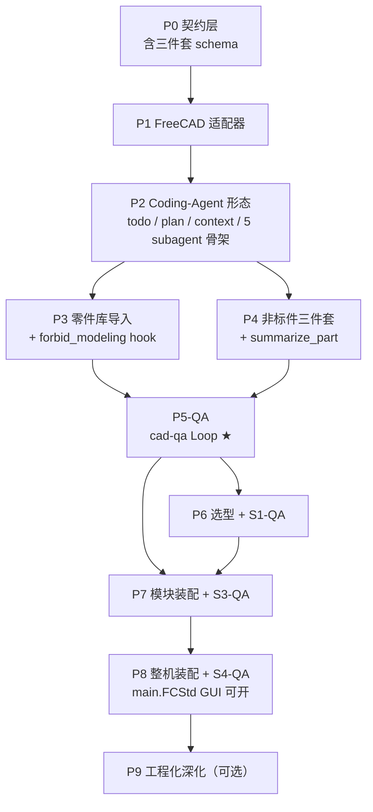

# CAD Agent — 产品路线图（v0.5 · Claude-Code-Style Multi-Agent + QA Loop）

> **定位**：**CathyAgent 仓库内增量开发**的 CAD 产品形态，**不另起 repo**、**不拆 monorepo 子包**。
> 把 CathyAgent 升级成一个**通用机械设计 Agent**：用户给一份需求（首个 benchmark 是 6DoF 机械臂，工作流不绑定特定机型），agent 自主完成 **选型 → 非标件 → 模块装配 → 整机装配**，每阶段经 QA Subagent 强制评审，终态在 FreeCAD GUI 直接打开。
>
> 本文档承担"目录契约 + Stage Gate + Multi-Agent 编排 + QA 协议"完整设计，专门展开四条产品需求：
> 1. agent 独立完成机械设计（6DoF 机械臂为首个 benchmark；标准件 / 选型 / 非标件 / 模块 / 整机 + 每阶段 agent 验收 + 终态 FreeCAD 可显示）；
> 2. **完整对齐 Claude Code 风格的 multi-agent / 工具体系**（Task subagent 派发协议 / Todo / Plan Mode / Skills / Hooks / Permission Gate / ToolView 全用上）；
> 3. **标准件走国标导入，禁止 LLM 建模**（catalog + import 工具 + Hook 强制隔离）；
> 4. **零件 / 模块 / 整机三层 = "Python 代码 + 摘要 + 产物"三件套**（落在用户指定目录），作为 **QA Subagent 阅读 + 反馈**的唯一真源（coding agent 的 PR 评审范式）。
>
> 与 `ROADMAP.md`（CathyAgent harness 通用线）关系：harness 升级走主 roadmap；CAD 产品的 multi-agent 编排 / Stage Gate / QA 协议走本文件。
>
> **协作模式**：实现由 agent（我）按本路线图逐 phase 编码；每个 phase 完成后用户做 code review。时间估算见 §13。

---

## 0. 四条产品需求 → 落地映射

| # | 用户原始需求 | v0.5 工程化拆解 | 主要落点 |
|---|--------------|------------------|----------|
| 1 | Agent 独立完成机械设计；每阶段验收；终态 FreeCAD 可显示 | 4 个 Stage Gate G1–G4 + **每个 Gate 强制经过 QA Subagent**；终态 `<project>/artifacts/main.FCStd` 双击可开 | P5–P8（业务线） + P5-QA（横切） |
| 2 | 参考 Claude Code 风格 coding agent / 工具 | **完整 multi-agent 角色矩阵**（5 个 cad-* subagent + 1 个主 director）+ Task tool 协议 + Todo + Plan Mode + 阶段感知 Permission + Skills progressive disclosure | P2（横切，详见 §4.2 / §5） |
| 3 | 标准件按国标导入，不建模 | 4 个 catalog（gb / motor / reducer / bearing）+ `import_*` 工具族 + **PreToolUse Hook 强制拦截**对标准件名的 build123d 建模调用 | P3 |
| 4 | 模型抽摘要，摘要 + 生成代码 → 放用户指定目录 → LLM 阅读判断是否合格 → 反馈 | 三层"三件套"契约（零件 / 模块 / 整机各一套）+ `summarize_*` 工具族 + **`cad-qa` subagent 读摘要+读代码做 PR 风格评审**，循环修复直到通过 | P0 / P4 / P5-QA |

---

## 1. 顶层架构（一图）

```text
┌───────────────────────────────────────────────────────────────────────────┐
│                            主 Agent (Stage Director)                       │
│   维护 Todo / Plan / 阶段状态；按 Stage 派发 Task；不直接碰 FreeCAD         │
├───────────────────────────────────────────────────────────────────────────┤
│                                Task 派发协议                                │
│   描述 / prompt / tools 白名单 / readonly / model；不传父 session 历史      │
├───────────────┬───────────────┬───────────────┬───────────────┬───────────┤
│ cad-explore   │ cad-selection │ cad-custom    │ cad-assembly  │ cad-qa    │
│ (只读·调研)   │ (S1 选型)     │ (S2 非标件)   │ (S3/S4 装配)  │ (横切·QA) │
│ read_meta /   │ catalog 检索 /│ build123d /   │ freecad MCP / │ 读摘要+读  │
│ list_dir /    │ 力矩链推算 /  │ summarize_part│ assemble_*    │ 代码做 PR │
│ read_skill    │ write bom     │ 三件套落盘    │ + 三件套落盘  │ 评审反馈   │
├───────────────┴───────────────┴───────────────┴───────────────┴───────────┤
│                          工具层（PluginRegistry）                          │
│ cad_library / cad_custom / cad_assembly / cad_verify / cad_todo /          │
│ file_ops / read_skill / shell_exec / mcp__freecad__* …                     │
├───────────────────────────────────────────────────────────────────────────┤
│ Hooks 中间件：permission_gate / forbid_modeling_for_standard_parts /        │
│            qa_loop_trigger / stage_gate_trigger / audit_log                 │
├───────────────────────────────────────────────────────────────────────────┤
│ 契约层：用户指定 project root → parts/<id>/  modules/<id>/  artifacts/      │
│         每层三件套：gen.py（或 assemble.py）+ meta.yaml + product           │
└───────────────────────────────────────────────────────────────────────────┘
```

两条主线并行：
- **基础设施线（P0 → P5-QA）**：契约 / 适配器 / coding-agent 形态补齐 / 零件库 / 非标件管线 / QA 闭环（不依赖具体机型）。
- **业务线（P6 → P8）**：6DoF 机械臂作为首个 benchmark；机型相关逻辑只放在 `motion_spec.json` 里，基础设施层完全机型无关。

---

## 2. 仓库布局（在 v0.4 基础上扩展）

```text
CathyAgent/
├── cathy/
│   ├── agent.py / context.py / hooks/ / mcp/ / plugins/ / skills/ …    # ✅ 已有 harness
│   ├── subagent/                       # ✅ 已有 planner_executor
│   │   ├── base.py / runner.py / tool_plugin.py
│   │   ├── planner_executor.py
│   │   └── cad/                        # ★ v0.5 新增：CAD 专用 subagent 矩阵
│   │       ├── __init__.py
│   │       ├── director.py             # 主 agent 形态的"Stage Director"扩展（可选；优先复用主 agent + skill）
│   │       ├── explore.py              # cad-explore（只读：读 meta / list_dir / read_skill）
│   │       ├── selection.py            # cad-selection（S1）
│   │       ├── custom.py               # cad-custom（S2）
│   │       ├── assembly.py             # cad-assembly（S3/S4）
│   │       └── qa.py                   # ★★ cad-qa（核心：读三件套做 PR 评审）
│   └── cad/                            # ★ v0.4 已规划：CAD 产品层（机型无关）
│       ├── schema.py                   # part / module / machine meta schema
│       ├── project.py                  # 项目目录（接受任意 root）
│       ├── adapters/
│       │   ├── freecad_mcp.py          # GUI 模式
│       │   └── freecad_cmd.py          # headless 模式
│       ├── library/                    # 标准件 + 电机 + 减速器 + 轴承 catalog
│       │   ├── gb_catalog.yaml
│       │   ├── motor_catalog.yaml
│       │   ├── reducer_catalog.yaml
│       │   ├── bearing_catalog.yaml
│       │   └── importer.py
│       ├── custom/                     # 非标件模板 + 摘要器
│       │   ├── templates/
│       │   └── summarizer.py
│       ├── verify/                     # G1–G4 谓词 + 报告
│       │   ├── gates.py
│       │   └── reports.py
│       ├── assembly/
│       │   ├── module.py
│       │   └── machine.py
│       └── qa/                         # ★ v0.5 新增：QA 闭环辅助
│           ├── pr_view.py              # 把三件套包装成"PR 视图"喂给 cad-qa
│           ├── feedback_schema.py      # QA 反馈结构（pass/fail + patches）
│           └── loop.py                 # 写→summarize→QA→修复→再 QA 的有限循环驱动
│
├── plugins/builtin/
│   ├── cad_library/                    # import_standard_part / import_motor / …
│   ├── cad_custom/                     # gen_custom_part / summarize_part
│   ├── cad_assembly/                   # assemble_module / assemble_machine / summarize_assembly
│   ├── cad_verify/                     # gate_check / freecad_recompute_check / interference_bbox
│   └── cad_todo/                       # ★ v0.5 新增：Claude-Code 风格 todo 工具（agent 自维护清单）
│
├── skills/
│   ├── cad/SKILL.md                    # ✅ 已有 headless build123d
│   ├── cad_selection/SKILL.md          # 选型流程
│   ├── cad_custom_part/SKILL.md        # 非标件三件套
│   ├── cad_module_assembly/SKILL.md    # 模块装配
│   ├── cad_full_assembly/SKILL.md      # 整机装配
│   ├── cad_qa/SKILL.md                 # ★ QA 评审 prompt 模板（PR 风格输出）
│   └── cad_director/SKILL.md           # ★ 主 agent 调度行为约束（何时派单 / 何时进下一阶段）
│
├── config/config.yaml                  # 新增 CAD_AGENT 段（含 default_project_root + permissions）
├── tools/cad/
│   ├── init_project.py                 # 用户任意路径
│   ├── validate_project.py
│   ├── regen_parts.py                  # CI 重生成 + meta 漂移
│   └── run_qa.py                       # ★ 单独命令行触发 cad-qa（方便手测 / CI）
│
├── benchmarks/
│   └── arm_6dof_v1/                    # 6DoF 机械臂内置 benchmark
│
├── ROADMAP.md                          # harness 通用线
├── ROADMAP_CAD_AGENT.md                # v0.4（保留）
└── ROADMAP_CAD_AGENT_v0.5.md           # ★ 本文件
```

---

## 3. 三层"三件套"契约（直接落需求 4）

CAD agent 跨阶段读懂几何的唯一真源 = **三件套**。三层（零件 / 模块 / 整机）形态对齐，**全部落在用户指定的项目根下**。

### 3.1 零件层（`<project>/parts/<part_id>/`）

```text
parts/shoulder_flange_v1/
├── gen.py             # ★ 参数化生成代码（build123d 或 FreeCAD macro）—— LLM 阅读对象 1
├── part.meta.yaml     # ★ 摘要（bbox / topology / interfaces / 假设）—— LLM 阅读对象 2
├── part.step          # 产物（CI 可重生成）
├── part.FCStd         # 可选：装配阶段引用
├── test_part.py       # 单零件回归
└── qa_history/        # ★ v0.5 新增：每轮 QA 评审记录（PR 评审 trail）
    ├── round_001.yaml
    ├── round_002.yaml
    └── final.yaml
```

`part.meta.yaml` schema 与 v0.4 一致，关键字段：`part_id` / `geometry.bbox` / `geometry.topology` / `geometry.is_closed` / `interfaces[]` / `library_refs[]` / `assumptions[]` / `source.generator_sha`。

### 3.2 模块层（`<project>/modules/<module_id>/`）

```text
modules/shoulder/
├── assemble.py        # ★ 装配脚本（freecad-mcp execute_code 落盘版）—— LLM 阅读对象 1
├── module.meta.yaml   # ★ 摘要（joints / parts_used / bom / bbox / dof）—— LLM 阅读对象 2
├── module.FCStd       # 产物
└── qa_history/
```

`module.meta.yaml` 新增字段：
- `parts_used[]`：每个 part_id + transform（占位 placement）
- `library_refs[]`：标准件 / 电机 / 减速器实例
- `joints[]`：与 `motion_spec.json` 对齐的关节定义
- `bom_rollup`：模块级 BOM 累加
- `envelope`：包络盒（mm）

### 3.3 整机层（`<project>/artifacts/`）

```text
artifacts/
├── assemble_main.py     # ★ 整机装配脚本（链接所有 module.FCStd）
├── main.meta.yaml       # ★ 整机摘要（dof_count / chain_topology / total_bom / mass_estimate）
├── main.FCStd           # ★ 终态交付物（FreeCAD GUI 双击可开）
├── main.step            # 可选：整机 STEP（CI 导出）
├── previews/            # 截图（每阶段 + 终态）
└── qa_history/          # 整机 QA 评审 trail
```

> **关键设计**：从 agent 视角，跨阶段沟通的唯一接口 = **三件套**。父 agent 派任务给 cad-qa 时**只传 `gen.py + meta.yaml` 路径**，cad-qa 自己 `read_file` 进来做评审，**不读 STEP**。这把"几何理解"压缩成 LLM 友好的代码 + 文档形式（≈ coding agent 看 PR diff + 单测）。

---

## 4. Claude Code 风格 Multi-Agent 设计（直接落需求 2）

### 4.1 主 agent（Stage Director）的形态

**不另开进程**，直接复用 CathyAgent 现有 `cathy/agent.py` 的 ReAct 主循环。它的"Director 行为"通过三层注入实现：

| 注入 | 来源 | 内容 |
|------|------|------|
| System 层 | `skills/cad_director/SKILL.md` | 调度行为约束（何时派单 / 何时跑 Gate / 何时进下一阶段 / 什么情况要求人工 approve） |
| Project 层 | `cathy/cad/context_plug.py`（v0.5 P2 新增） | 当前项目 `machine.meta.yaml` + 各 Stage 状态 + Todo 列表 → 拼进 ContextAssembler |
| Scratchpad 层 | `cad_todo` 工具维护 | 主 agent 的 todo 清单（运行时可读可写） |

主 agent 的可用工具（默认 ToolView）：
- `read_file` / `list_dir` / `write_file`（受 Hook 约束在 `<project>/` 内）
- `read_skill`
- `todo_*`（cad_todo 插件）
- **Task 派发工具**（cad-explore / cad-selection / cad-custom / cad-assembly / cad-qa；通过 `SubagentToolPlugin` 包装）
- `gate_check`（直接调，不必派 subagent）
- **不允许直接调 `mcp__freecad__execute_code`**（必须经 cad-assembly subagent；强制 ToolView 屏蔽）

### 4.2 Subagent 角色矩阵（对齐 Claude Code 的 Task subagent_type）

| Subagent | 对应 CC 角色 | 默认 readonly | 可用工具白名单（ToolView） | 入参（input_schema 摘要） | 产出契约（final_answer） |
|----------|--------------|---------------|----------------------------|----------------------------|--------------------------|
| **cad-explore** | `explore` | ✅ | `read_file` / `list_dir` / `read_skill` / `read_meta` | `{question, scope}` | Markdown 调研报告（含文件路径 + 关键摘要片段） |
| **cad-selection** | specialist（S1） | ❌（要 write bom.yaml） | + `list_available` / `write_file`（限定 `stages/S1_selection/`） | `{requirements_md, motion_spec_path, target_dir}` | `bom.yaml` 路径 + `rationale.md` 路径 + 自检结论 |
| **cad-custom** | specialist（S2） | ❌ | + `gen_custom_part` / `summarize_part` / `shell_exec`（仅跑 `gen.py`） | `{part_spec, target_dir, template_hint?}` | `parts/<id>/` 三件套路径 + summarize 结果 |
| **cad-assembly** | specialist（S3/S4） | ❌（且需 `mcp__freecad__execute_code` ask 权限） | + `import_*` / `assemble_module` / `assemble_machine` / `summarize_assembly` / `mcp__freecad__*` | `{stage: "S3"|"S4", module_id?, target_dir}` | `module.FCStd / main.FCStd` + meta + 装配脚本路径 |
| **cad-qa** | **verifier / generalPurpose**（核心） | ✅（只读，绝不改文件） | `read_file` / `list_dir` / `read_skill` / `gate_check`（只读形式） | `{stage, target_dir, scope: "part"|"module"|"machine", spec_ref}` | **结构化 QA 反馈**（见 §5.3） |

### 4.3 Task 派发协议（Claude-Code 风格落地）

主 agent 派单的 tool call 示例（OpenAI function-calling JSON）：

```json
{
  "name": "cad-qa",
  "arguments": {
    "stage": "S2",
    "target_dir": "/Users/eastwu/work/my_arm/parts/shoulder_flange_v1",
    "scope": "part",
    "spec_ref": "/Users/eastwu/work/my_arm/stages/S1_selection/bom.yaml#shoulder_flange",
    "description": "PR-style review of shoulder_flange_v1 part triplet",
    "prompt": "请对 shoulder_flange_v1 做 PR 评审：读 gen.py + part.meta.yaml，对照 BOM 中接口定义（电机法兰 Φ64 / M5×4）核对 interfaces[]；体积量级是否合理；assumptions 是否过激。输出 QA 反馈结构。"
  }
}
```

- **subagent 内部不看父 session 历史**：和 `planner_executor` 同款隔离（已实现）。
- **subagent 的 ToolView 由 manifest 写死**：`cad-qa` 即使 LLM 想写文件，工具也不会暴露给它。
- **subagent 输出只回一个 `final_answer` 字符串**：cad-qa 这条 final_answer 必须是 YAML/JSON 结构化（见 §5.3），主 agent 拿到后落盘到 `qa_history/round_NNN.yaml`。

### 4.4 Todo / Plan Mode / 阶段感知 Permission（P2 横切补齐）

| 组件 | v0.5 落点 | 说明 |
|------|-----------|------|
| **Todo 工具** | `plugins/builtin/cad_todo/` | `todo_list` / `todo_add` / `todo_done` / `todo_reset`；落盘到 `<project>/.cad_todo.json`，CLI 渲染 `☐ / ☑` |
| **Plan Mode** | `cathy/modes/plan.py` + Hook | 只读模式：ToolView 把所有写工具 + subagent 派发**全屏蔽**，agent 强制先用 markdown 输出方案；用户 approve 后切回 agent 模式 |
| **Project Context 注入** | `cathy/cad/context_plug.py` | 启动 / SessionStart hook 时把 `machine.meta.yaml` + 当前 stage 状态 + todo 列表注入 system prompt 末尾 |
| **阶段感知 Permission** | 扩展 `PERMISSION.mcp_rules` | S1/S2 阶段 `mcp__freecad__execute_code: deny`；S3 阶段 `ask`；S4 阶段 `ask` 且 matcher 限定模块 ID；落到 hook 配置 |
| **强制 read_skill 引导** | `skills/cad_director/SKILL.md` | "做 CAD 任务前必须先 `read_skill('cad_director')`；派 subagent 时必须先 `read_skill('cad_<role>')`" |

---

## 5. QA Subagent 闭环（直接落需求 4 + 需求 1 的"每阶段验收"）

### 5.1 QA 在整体流程中的位置

```text
   ┌─────────────────────────────────────────────────────────────┐
   │ 主 agent 派 cad-custom → custom 写 gen.py → 跑 shell_exec    │
   │   → 调 summarize_part 落 meta.yaml → 三件套齐 → 主 agent 接管  │
   └─────────────────────────────────────────────────────────────┘
                              │
                              ▼   PostToolUse hook: qa_loop_trigger
                              │
            ┌─────────── cad-qa subagent ───────────┐
            │ 1. read_file(gen.py)                  │
            │ 2. read_file(meta.yaml)               │
            │ 3. read_skill('cad_qa')               │
            │ 4. 调 gate_check（只读形态）           │
            │ 5. 输出结构化反馈                       │
            └─────────────────┬─────────────────────┘
                              │
              ┌───────────────┴───────────────┐
              │                               │
        PASS（写 final.yaml）           FAIL（写 round_NNN.yaml）
              │                               │
              ▼                               ▼
        主 agent 标 todo done       主 agent 派 cad-custom 修复
                                              │
                                              └── 回到顶部循环（最多 N 轮）
```

### 5.2 触发方式（不依赖 LLM 主动派单）

- **被动触发**（推荐主路径）：`PostToolUse` hook 监听 `summarize_part / summarize_assembly` 成功 → 自动构造 cad-qa Task call 插入主 agent 消息队列。
- **主动触发**：主 agent 按 `skills/cad_director/SKILL.md` 指示，每完成一个三件套**必须**派一次 cad-qa（director skill 里写死）。
- **CLI 手动触发**：`python -m tools.cad.run_qa <project>/parts/<id>` —— 方便回归 / CI。

### 5.3 QA 反馈结构（cad-qa 的 final_answer 必须遵守）

```yaml
# 写入 <target_dir>/qa_history/round_NNN.yaml
qa_round: 1
stage: S2
scope: part
target: shoulder_flange_v1
verdict: fail            # pass | fail | needs_clarification
score: 0.62              # 0.0–1.0
findings:
  - severity: blocker    # blocker | major | minor | nit
    location: gen.py:L42
    issue: "中心孔 Φ24 与 BOM 中电机轴径 Φ20 不一致"
    suggestion: "把 PARAMS['CENTER_HOLE_D'] 改成 20.0，并在 part.meta.yaml.assumptions 移除 '允许 ±2mm 自由配合'"
    auto_patch:          # 可选：可直接 apply 的 patch hunk
      file: gen.py
      diff: |
        - "CENTER_HOLE_D": 24.0,
        + "CENTER_HOLE_D": 20.0,
  - severity: major
    location: part.meta.yaml:interfaces[0]
    issue: "缺少 bolt_size，导致装配阶段无法选螺栓"
    suggestion: "补 bolt_size: M5，与 BOM 中 GB/T 70.1-2008 M5×16 对齐"
  - severity: minor
    location: gen.py
    issue: "倒角 chamfer=0.5mm 未在 assumptions 里声明"
    suggestion: "在 meta.assumptions[] 追加一条"
checks_run:
  - gate: G2
    passed: false
    failing_predicates: ["interfaces.bolt_size_present", "bbox_matches_bom"]
spec_alignment:
  bom_match: 0.7
  interface_match: 0.5
  envelope_match: 1.0
next_action: revise      # revise | escalate_to_human | continue
notes: "若 motor 选型确定是 80ST-M02430，请直接采用 Φ20 中心孔；否则需 cad-explore 先确认。"
```

### 5.4 主 agent 接 QA 反馈后的行为约束（写在 `skills/cad_director/SKILL.md`）

```text
若 cad-qa.verdict == "pass":
  - 把对应 todo 标 done
  - 落 qa_history/final.yaml
  - 继续下一个 part / module / stage

若 cad-qa.verdict == "fail":
  - 落 qa_history/round_<NNN>.yaml
  - 若 round < MAX_ROUNDS (默认 3):
      - 派 cad-custom（或 cad-assembly）回到对应 stage 做修复，prompt 必须**带上 findings 列表**
  - 若 round >= MAX_ROUNDS:
      - 升级：暂停 stage、用 notification hook 通知人工 approve
      - 不允许在 fail 状态下进入下一个 stage（gate_check 兜底）

若 cad-qa.verdict == "needs_clarification":
  - 派 cad-explore 调研缺失信息（绝不允许猜）
  - 然后回到原 stage 重做
```

### 5.5 cad-qa 的 SKILL（`skills/cad_qa/SKILL.md`）要写什么（摘要）

- 输入约定：你只读 `gen.py + meta.yaml + 可选 spec`，**不要读 STEP**（你也读不动）。
- 评审视角五条线：
  1. **代码 vs 摘要一致性**（meta 里写的接口数 / 体积 / bbox 与 gen.py 里 PARAMS 推得出的是否对得上）；
  2. **摘要 vs spec 一致性**（接口 ID / bolt_size / 法兰直径 与 BOM / motion_spec 是否对得上）；
  3. **代码可重生**（PARAMS 集中？无硬编码？无 viewer 弹窗？）；
  4. **几何健全性**（gate_check 结果；`is_closed=true`；solids ≥ 1）；
  5. **假设合理性**（assumptions[] 是否过激；有没有"我猜的"）。
- 输出格式严格按 §5.3 schema，**不要写自由格式 markdown**（主 agent 要解析）。
- 不要试图修文件；只输出 `auto_patch.diff`，由主 agent 决定是否 apply。

---

## 6. 标准件国标导入（直接落需求 3）

### 6.1 catalog 设计

`cathy/cad/library/gb_catalog.yaml`（首批覆盖范围）：

```yaml
families:
  - id: bolt_hex_socket            # 内六角螺钉
    gb: GB/T 70.1-2008
    backend: fasteners_wb          # FreeCAD Fasteners workbench（参数化、零版权风险）
    sizes: [M3, M4, M5, M6, M8, M10]
    length_range: [5, 80]
  - id: bolt_hex_head              # 六角螺栓
    gb: GB/T 5783-2016
    backend: fasteners_wb
    sizes: [M4, M5, M6, M8, M10, M12]
  - id: nut_hex
    gb: GB/T 6170-2015
    backend: fasteners_wb
    sizes: [M3, M4, M5, M6, M8, M10]
  - id: washer_flat
    gb: GB/T 97.1-2002
    backend: fasteners_wb
    sizes: [M3, M4, M5, M6, M8, M10]
  - id: bearing_deep_groove
    gb: GB/T 276-2013
    backend: step_lib              # 本地 STEP 库（按 hash 缓存到 <project>/library_imports/）
    series: [6204, 6205, 6206, 6207, 6208, 6209, 6210]
  - id: bearing_angular_contact
    gb: GB/T 297-2015
    backend: step_lib
    series: [7204, 7205, 7206, 7207, 7208, 7209, 7210]
```

`motor_catalog.yaml` / `reducer_catalog.yaml` 同形态（先内置 5–10 占位型号）。

### 6.2 工具族（`plugins/builtin/cad_library/`）

| 工具 | 入参 | 行为 |
|------|------|------|
| `import_standard_part` | `gb_ref, size, qty, target_doc, placement` | 按 backend 路由：fasteners_wb → FreeCAD macro；step_lib → import STEP；插入到 `target_doc` |
| `import_motor` | `model, target_doc, placement` | 路由到 motor_catalog；缺货时用占位 STEP（同规格圆柱体 + 法兰）+ `meta.placeholder: true` |
| `import_reducer` | `model, target_doc, placement` | 同上 |
| `import_bearing` | `gb_ref or model, size, target_doc, placement` | 同上 |
| `list_available` | `filter: {kind, gb?, motor_series?, ...}` | 给 cad-selection 调研用 |

### 6.3 **强制禁止 agent 对标准件建模**（Hook 实现）

新增 hook `forbid_modeling_for_standard_parts`（`cathy/hooks/builtin.py`）：

- 事件：`PreToolUse`
- matcher：`gen_custom_part|shell_exec`（cover build123d 路径）
- 逻辑：
  1. 解析入参里的 `part_id / display_name / spec`；
  2. 与 `gb_catalog.yaml` / `motor_catalog.yaml` 等做模糊匹配（如 `bolt` / `screw` / `nut` / `bearing` / `motor` / `reducer` 关键字 + GB 编号正则）；
  3. 命中 → `HookDecision(block=True, block_reason="标准件不允许建模，请改用 import_standard_part(gb_ref=...)")`；
  4. 模型 self-correct（这正是 hook 设计的目的）。

> 与现有 `block_dangerous_paths` 是同款机制；用户写非标件时不会受影响（关键词不匹配）。

### 6.4 配置（`config.yaml` 新增）

```yaml
PERMISSION:
  mcp_rules:
    deny: ["mcp__fs__delete_*"]
    ask: ["mcp__freecad__execute_code"]
    allow: ["mcp__freecad__import_step", "mcp__freecad__recompute", "mcp__freecad__save_as"]

CAD_AGENT:
  enabled: true
  default_project_root: ~/cad_projects
  freecad:
    backend: freecad_mcp
    version_lock: "1.1"
  library:
    standard_catalog: cathy/cad/library/gb_catalog.yaml
    motor_catalog: cathy/cad/library/motor_catalog.yaml
    reducer_catalog: cathy/cad/library/reducer_catalog.yaml
    bearing_catalog: cathy/cad/library/bearing_catalog.yaml
  qa:
    max_rounds: 3
    auto_trigger_after: ["summarize_part", "summarize_assembly"]
    feedback_dir_name: qa_history
  permissions:
    allow_execute_code: ask
    stage_aware:
      S1: { mcp__freecad__execute_code: deny }
      S2: { mcp__freecad__execute_code: deny }
      S3: { mcp__freecad__execute_code: ask }
      S4: { mcp__freecad__execute_code: ask }
```

---

## 7. 分阶段路线图（v0.5 增量；编号沿用 v0.4）

> 与 v0.4 重叠的 Phase 标注"沿用 v0.4，本 v0.5 增量在此"；新增内容用 ★ 标注。

### Phase 0｜契约层（1 周·沿用 v0.4）

**沿用 v0.4 的 P0**：`schema.py` / `project.py` / `init_project.py` / `validate_project.py` / `CAD_AGENT` 配置段。

**v0.5 增量**：
- ★ 把 schema 扩展到三层（part / module / machine 各一份），并在 schema 里**强制 `qa_history/` 目录占位**（init 时建空目录）。
- ★ `Project.open(root)` 新增方法：`write_triplet(scope, id, gen, meta, product)` / `read_triplet(scope, id)` / `append_qa_round(scope, id, feedback)`。

**验收**：
- 任意路径 init 后 → `<root>/parts/`、`<root>/modules/`、`<root>/artifacts/`、`<root>/.cad_todo.json` 均生成；
- `validate_project` 对缺失 qa_history 给具体错误（路径 + 字段名）。

---

### Phase 1｜FreeCAD 适配器（1 周·沿用 v0.4）

完全沿用 v0.4 的 P1。

---

### Phase 2｜Coding-Agent 形态补齐 ★（横切，1.5–2 周）

**v0.4 范围**：todo / plan mode / project context 注入 / 阶段感知 Permission。

**v0.5 增量（核心）**：

| 组件 | 文件 | 说明 |
|------|------|------|
| ★ `cad_todo` 插件 | `plugins/builtin/cad_todo/` | 4 个工具 + 落盘到 `<project>/.cad_todo.json`；render 风格对齐 Claude Code（`☐ / ☑ / ⏳ in_progress`） |
| ★ Plan Mode | `cathy/modes/plan.py` + hook `mode_gate` | 只读模式：ToolView 屏蔽所有写工具与 Task 派发；agent 必须先输出 plan markdown |
| ★ `cathy/cad/context_plug.py` | 注入器 | SessionStart hook 时拼接 `machine.meta.yaml` + 各 stage 状态 + todo 列表 |
| ★ Task 派发协议规范化 | `cathy/subagent/tool_plugin.py` 扩展 | 增加 `description` / `prompt` / `tools` 白名单 / `readonly` / `model` 入参；对齐 CC 的 Task tool schema |
| ★ `skills/cad_director/SKILL.md` | 主 agent 行为约束 | 包含 §5.4 的决策树 |
| ★ 5 个 cad-* subagent 骨架 | `cathy/subagent/cad/*.py` | 先空实现（直接调底层工具的薄包装），后续 phase 逐个填业务 |

**验收**：
- 跑一个 mock 闭环：用户给一个零件 spec → 主 agent 维护 todo → 派 cad-custom（mock：写一个 dummy gen.py + meta） → PostToolUse hook 触发 cad-qa（mock：评审 dummy） → 主 agent 收到 QA → 标 todo done → 终止。
- 在 plan 模式下试图调 `write_file` 直接被屏蔽；切回 agent 模式后正常。
- `cad_todo` 工具在 CLI 渲染正确。

---

### Phase 3｜零件库导入（1.5–2 周·沿用 v0.4 + 增量）

**v0.4 范围**：4 个 catalog + import 工具族。

**v0.5 增量**：
- ★ **`forbid_modeling_for_standard_parts` hook**（§6.3）落地 + 单元测试（命中关键字 → block；非标件不影响）；
- ★ `list_available(filter)` 工具明确给 cad-selection 调研用；
- ★ catalog 文件加 `placeholder_step_for_unknown: true` 字段，缺货时用同尺寸圆柱体占位（避免阻塞 P7/P8）。

**验收**：
- Golden test：给定一份 BOM（8 螺栓 + 2 电机 + 2 减速器 + 4 轴承），主 agent 调一次 import_* → FCStd 中正确生成；
- 故意让 agent 试图 build123d 建模一颗 M5×16 螺栓 → hook 拦截 + 模型按提示改用 `import_standard_part` 成功。

---

### Phase 4｜非标件参数化管线（2 周·沿用 v0.4 + 强化三件套）

**v0.4 范围**：5 个零件模板 + `summarize_part` + `gen_custom_part` + interfaces 命名约定。

**v0.5 增量**：
- ★ `summarize_part` 输出的 meta 强化字段：`source.generator_sha` / `source.params_hash` / `interfaces[]` 自动从命名约定识别（`if_motor_flange` 等）；
- ★ 三件套**强制落盘到用户指定 project 路径**（路径由入参 `target_dir` 决定，而非工作区临时目录）；
- ★ 三件套落盘后 PostToolUse hook 自动 enqueue 一次 cad-qa（即 §5.2 自动触发主路径）；
- ★ `tools/cad/regen_parts.py <project>` 增加 `--strict-qa` 选项：重生成后强制重跑 QA，对比 round 数与上次 final.yaml。

**验收**：
- 5 模板全部能由 cad-custom 派生出可用零件；
- 改 PARAMS 后 `regen_parts.py --strict-qa` 重生成 + meta 更新 + QA 自动重跑；
- 从 agent 视角，**主 agent 全程只读 `part.meta.yaml`**，从未读 STEP。

---

### Phase 5-QA｜QA Subagent + Loop ★（横切，1.5 周）

**v0.5 全新核心 Phase**（v0.4 的 P5 验证 Subagent 合并到这里 + 升级为 PR 评审形态）。

**做**：
- `cathy/subagent/cad/qa.py`：实现 cad-qa subagent（SubagentRunner 子类；input_schema 见 §4.2；输出契约见 §5.3）；
- `cathy/cad/qa/pr_view.py`：把三件套包装成"PR 视图"（路径 + 摘要片段）喂给 LLM；
- `cathy/cad/qa/feedback_schema.py`：jsonschema 校验 final_answer 必须符合 §5.3 结构（不符合 → 重试 1 次 → 标 failed）；
- `cathy/cad/qa/loop.py`：循环驱动（max_rounds / round 持久化 / 升级到人工）；
- `cathy/cad/verify/gates.py`：G1–G4 谓词作为 cad-qa 内部"checks_run"调用；
- `skills/cad_qa/SKILL.md`：评审 prompt 模板（§5.5）；
- Hook `qa_loop_trigger`（`PostToolUse`，matcher：`summarize_*`）；
- Hook `stage_gate_trigger`（`PostToolUse`，matcher：`assemble_*`）。

**验收**：
- 故意坏掉的 fixture（gen.py 中心孔 Φ24 / BOM 写 Φ20）→ cad-qa 输出 verdict=fail + 命中 ≥ 1 个 blocker + 给 auto_patch diff；
- 主 agent 收到 fail → 派 cad-custom 修复 → 再 QA → verdict=pass；
- 整个 loop 持久化到 `qa_history/round_001.yaml` / `round_002.yaml` / `final.yaml`；
- 反馈结构 jsonschema 校验通过；不合规的输出会重试并最终标 failed。

---

### Phase 6｜选型 Subagent（2 周·沿用 v0.4 + QA 接入）

**v0.4 范围**：需求 → BOM 翻译；力矩链反推；rationale.md。

**v0.5 增量**：
- ★ S1 完成后**自动派 cad-qa**（scope=stage，spec_ref=requirements.md）；
- ★ cad-qa 在 S1 上的检查重点：每个关节是否齐备 reducer + motor + bearing；BOM 项是否全命中 catalog；力矩裕度是否 ≥ 1.5；rationale.md 是否对每条选择给理由。

---

### Phase 7｜模块装配 Subagent（2–4 周·沿用 v0.4 + QA 接入）

**v0.4 范围**：6DoF 6 个关节模块；`assemble_module` 后端走 freecad-mcp。

**v0.5 增量**：
- ★ 装配脚本必须落盘到 `<project>/modules/<id>/assemble.py`（不允许只在内存里执行）；
- ★ `summarize_assembly` 工具同时写 `module.meta.yaml`；
- ★ 模块三件套（assemble.py + module.meta.yaml + module.FCStd）齐 → PostToolUse 自动派 cad-qa；
- ★ cad-qa 模块视角检查：每个 part_id 是否在 parts/<id>/ 存在；joints 与 motion_spec 一致；包络 ≤ spec；BOM 累加正确。

---

### Phase 8｜整机装配 + Stage Gate 全链（2–3 周·沿用 v0.4 + 终局 QA）

**v0.4 范围**：S1–S4 全链跑通；`main.FCStd` GUI 可开。

**v0.5 增量**：
- ★ 整机三件套（assemble_main.py + main.meta.yaml + main.FCStd）齐 → 自动派 cad-qa（scope=machine）；
- ★ cad-qa 整机视角检查：自由度计数 == spec；运动链闭合（链式 transform 校验）；整机 BOM = 模块 BOM 累加；包络 ≤ spec；干涉 bbox 占位检查 pass；
- ★ 全部 pass 后**自动截图**到 `<project>/artifacts/previews/main_*.png`（多视角）；
- ★ **最终验收**：在干净的目录上从需求 markdown 出发，全自动跑完 S1→S4，FreeCAD 1.1.1 双击 `main.FCStd` 无报错。

---

### Phase 9（可选）｜工程化深化

沿用 v0.4 §4 P9，全部条目不变。新增一条：
- ★ QA RAG：积累若干失败案例后，给 cad-qa 加一层 RAG（检索历史 qa_history/round_*.yaml），让评审更稳。

---

## 8. 阶段依赖（Mermaid）



---

## 9. 关键决策（v0.5 收口）

| 议题 | v0.5 决策 |
|------|-----------|
| 主 agent 是新实体还是复用 CathyAgent？ | **复用**。通过 `skills/cad_director/SKILL.md` + project context 注入实现"Director 行为"，不另起进程 |
| Subagent 编排范式 | **Task 派发**（CC 风格，平级派单），而非 planner_executor（保留作为 fallback 复杂任务） |
| cad-qa 是否可写文件 | **不可写**。只输出结构化 final_answer；主 agent 负责落盘 qa_history 和 apply patch |
| 三件套是否必须 LLM 可读 | **必须**。gen.py 集中 PARAMS；meta.yaml 字段固定；STEP 视为黑盒不读 |
| QA 触发方式 | **自动为主**（PostToolUse hook on `summarize_*`），director skill 兜底要求每个三件套都过 QA |
| 标准件能否被建模 | **不能**。`forbid_modeling_for_standard_parts` hook 在 PreToolUse 拦截 |
| 项目根路径 | **用户指定**（CLI `--project` / 环境变量 `CAD_PROJECT` / SDK `Project.open(root)`） |
| max_rounds 默认值 | **3**。第 4 轮自动升级到人工 approve |
| FreeCAD 终态 | `<project>/artifacts/main.FCStd` **GUI 双击可开** |

---

## 10. 与 CathyAgent harness 的复用矩阵（v0.5 视角）

| harness 能力 | v0.5 CAD agent 怎么用 | 是否需要 harness 改动 |
|--------------|------------------------|----------------------|
| `cathy/agent.py` ReAct 主循环 | 主 agent（Stage Director）直接复用 | ❌ |
| `cathy/subagent/{base,runner,tool_plugin}.py` | 5 个 cad-* subagent 全部继承 | ❌（已具备 ToolView + readonly） |
| `cathy/subagent/planner_executor.py` | 保留作为 fallback；CAD 主路径不用 | ❌ |
| `PluginRegistry` + manifest | cad_* 插件按目录注册 | ❌ |
| `cathy/mcp/`（FastMCP） | 接 freecad-mcp；阶段感知权限走 mcp_rules | ❌ |
| `ContextAssembler` | P2 新增 project context plug 注入层 | ⚠️ 加一个挂载点 |
| `HookManager` | qa_loop_trigger / stage_gate_trigger / forbid_modeling / permission_gate | ❌（已支持 glob matcher） |
| `Skills`（progressive disclosure） | cad / cad_selection / cad_custom_part / cad_module_assembly / cad_full_assembly / cad_qa / cad_director | ❌ |
| `Sandbox`（seatbelt / local_restricted） | 跑 gen.py 时统一走 sandbox | ❌ |
| Session 持久化 | 每个 CAD project 一个 session，便于回放 | ❌ |

> 关键：**所有改动 ≈ 90% 是配置 + skill + plugin + subagent 类**，只对 `ContextAssembler` 加一个挂载点。延续"基于 CathyAgent 增量"的路线，不动 harness 主线节奏。

---

## 11. 风险与待定

| 风险 | 说明 | 应对 |
|------|------|------|
| QA 评审"幻觉打分" | LLM 给 verdict=pass 但实际有错 | feedback_schema 强约束 + gate_check 谓词兜底 + 关键字段 jsonschema 校验 |
| QA 循环死循环 | round 一直 fail | max_rounds=3 硬上限 + 升级到 notification hook |
| 三件套不同步漂移 | 用户手改 STEP / 改 gen.py 没重生 | `regen_parts.py --strict-qa` 定期跑；CI 强制 generator_sha 与产物一致 |
| 标准件占位 STEP 误用 | 占位圆柱体被当成真件 | meta.placeholder: true 字段；cad-qa 看到 placeholder=true 时强制 warn |
| 主 agent 不派 cad-qa 偷懒 | LLM 不读 director skill | hook 自动派单（PostToolUse on summarize_*） + skill 兜底 |
| `mcp__freecad__execute_code` 滥用 | 任意 Python 入 FreeCAD | 阶段感知 permission（S1/S2 deny / S3/S4 ask）+ 装配脚本落盘可审计 |
| FreeCAD 版本漂移 | 1.0 / 1.1 / dev 之间 TypeId / API 不一致 | `CAD_AGENT.freecad.version_lock` 锁 1.1；适配器层抹平差异 |
| 电机/减速器版权 | 厂商 STEP 可分发性 | 紧固件优先 Fasteners workbench（参数化无版权）；商用件按购买协议；缺货用占位 STEP（同尺寸圆柱 + 法兰）|
| FreeCAD 实测耗时 | freecad-mcp 集成、GUI 双击验证需人在场 | 适配器层有 mock 后端，CI 跑 mock；FreeCAD 实测放每个 phase 的人工 review 环节 |

---

## 12. 文档修订记录

| 版本 | 日期 | 说明 |
|------|------|------|
| **0.5.0** | **2026-05-14** | 首版独立成稿（合并历次 v0.1–v0.4 设计 + 新增 Claude Code 风格 multi-agent + QA Loop）：5 个 cad-* subagent 角色矩阵；Phase 5-QA 作为核心横切；三件套契约抬到三层；标准件建模 hook 级强制禁止；Stage Gate 强制经 QA 闭环 |

---

## 13. 工作时间表（AI 实现 + 人类 code review 节奏）

> **协作前提**：
> - 实现由 agent（我）按 phase 编码；每个 phase 完成后用户做 code review。
> - 单次 phase 内 AI 实现快、卡点在 review + FreeCAD 实测（需人在场）。
> - 时间单位用"人日"（agent 实现 + human review 串联起来的钟点）。
> - 各 phase 拓扑依赖见 §8 Mermaid 图，部分 phase 可并行。

### 13.1 总览（按 sprint 切片）

| Sprint | 周次 | 内容 | AI 实现人日 | Human review 人日 | 备注 |
|--------|------|------|-------------|-------------------|------|
| **S1 骨架** | W1 | P0 契约层 + P2 Coding-Agent 形态主干（todo / plan mode / context plug / 5 subagent 空骨架 / cad-director skill） | 1.5–2 | 1 | 不依赖 FreeCAD，纯 harness 扩展，可全速推进 |
| **S2 闭环** | W2 | P5-QA 核心（cad-qa subagent + feedback schema + qa_loop_trigger hook + cad-qa skill） + 单元 fixture | 1.5–2 | 1 | **本路线图的"第一个能跑的闭环"**，mock 三件套也能跑 |
| **S3 适配器** | W3 上半 | P1 FreeCAD 适配器（freecad_mcp + freecad_cmd 双后端 + 5 个最小操作） | 1–1.5 | 1（FreeCAD 实测） | 卡点：用户需在 mac 上跑 FreeCAD 实测；mock 后端先保 CI |
| **S3 库件** | W3 下半 | P3 零件库导入（gb/motor/reducer/bearing catalog + import 工具族 + forbid_modeling hook） | 1.5–2 | 1 | Golden test：M5×16 螺栓 catalog → import → FCStd 看到对象 |
| **S4 非标件** | W4 | P4 非标件管线（5 模板 + summarize_part + 三件套落盘 + regen_parts CI） | 2–3 | 1–2 | 与 S2 的 QA Loop 自动串联：写零件 → 自动 QA → 修复循环跑通 |
| **S5 选型** | W5 | P6 选型 subagent（cad-selection skill + sizing rules + S1-QA 接入） | 1.5–2 | 1 | 给一份 1 页需求 markdown → 输出 BOM + rationale.md |
| **S6 模块装配** | W6 + W7 上半 | P7 模块装配 subagent（cad-assembly + freecad-mcp execute_code 接入 + S3-QA） | 3–5 | 2–3（FreeCAD 实测多） | 卡点：freecad-mcp 实测、阶段感知 permission 调试；建议先跑通 shoulder 一个模块 |
| **S7 整机** | W7 下半 + W8 | P8 整机装配 + Stage Gate 全链 + 端到端 6DoF benchmark | 2–3 | 1–2 | 终态验收：`<project>/artifacts/main.FCStd` FreeCAD GUI 双击可开 |

**合计**：
- AI 实现：**14–20 人日**
- Human review + FreeCAD 实测：**9–13 人日**
- 串联总周期：**约 7–8 周**（人 review 与 AI 实现可错峰，部分并行；但 FreeCAD 实测必须人在场）

### 13.2 各 sprint 详细任务清单

#### Sprint 1（W1）骨架 · AI 实现 1.5–2 人日

- [ ] `cathy/cad/schema.py`：三层 meta jsonschema（part / module / machine） + 三类 stage report schema
- [ ] `cathy/cad/project.py`：`Project.open(root)` + `parts_dir / modules_dir / artifacts_dir` + `write_triplet / read_triplet / append_qa_round`
- [ ] `tools/cad/init_project.py <PATH>`：在任意路径建空目录骨架
- [ ] `tools/cad/validate_project.py <PATH>`：扫描 + jsonschema 校验，错误带具体路径 + 字段
- [ ] `config/config.yaml` 新增 `CAD_AGENT:` 段（含 default_project_root / freecad / library / qa / permissions）
- [ ] `plugins/builtin/cad_todo/`：`todo_list / todo_add / todo_done / todo_reset`（落到 `<project>/.cad_todo.json`）
- [ ] `cathy/modes/plan.py`：Plan Mode（ToolView 屏蔽写工具 + Task 派发）
- [ ] `cathy/cad/context_plug.py`：SessionStart hook 注入 machine.meta + stage 状态 + todo
- [ ] `cathy/subagent/cad/{explore,selection,custom,assembly,qa}.py`：5 个空骨架（manifest + hello world）
- [ ] `skills/cad_director/SKILL.md`：主 agent 调度行为约束 + §5.4 决策树
- [ ] `skills/cad_qa/SKILL.md`：QA 评审 prompt（§5.5）
- [ ] `tests/test_cad_phase0.py`：项目 init / validate / Project API
- [ ] `tests/test_cad_todo.py`：todo 增删查改

**Review 检查点**：`python -m tools.cad.init_project /tmp/test1` 全绿；REPL 派 cad-qa（mock 返回 pass）闭环跑通；现有 129+ 用例无 regression。

#### Sprint 2（W2）QA 闭环 · AI 实现 1.5–2 人日

- [ ] `cathy/subagent/cad/qa.py`：cad-qa 真实实现（继承 SubagentRunner；ToolView readonly）
- [ ] `cathy/cad/qa/pr_view.py`：三件套包装为"PR 视图"
- [ ] `cathy/cad/qa/feedback_schema.py`：§5.3 schema 校验
- [ ] `cathy/cad/qa/loop.py`：循环驱动（max_rounds / round 持久化 / 升级人工）
- [ ] `cathy/hooks/builtin.py`：新增 `qa_loop_trigger`（PostToolUse on `summarize_*`）+ `stage_gate_trigger`
- [ ] `cathy/cad/verify/gates.py`：G1–G4 谓词（先实现 G2，其他占位）
- [ ] `tools/cad/run_qa.py`：CLI 单独触发 cad-qa
- [ ] `tests/fixtures/parts/bad_flange_v1/`：故意坏掉的三件套（中心孔 Φ24 vs BOM Φ20）
- [ ] `tests/test_cad_qa.py`：bad fixture → fail + auto_patch；fix 后再跑 → pass；schema 不合规 → 重试 / failed

**Review 检查点**：bad fixture 跑出 fail + ≥1 个 blocker + auto_patch diff；qa_history/round_001.yaml / round_002.yaml / final.yaml 落盘形态正确。

#### Sprint 3（W3）适配器 + 标准件 · AI 实现 2.5–3.5 人日

- [ ] `cathy/cad/adapters/freecad_mcp.py`：复用 cathy/mcp + freecad-mcp
- [ ] `cathy/cad/adapters/freecad_cmd.py`：headless macro 后端
- [ ] `cathy/cad/adapters/mock.py`：CI 用 mock 后端
- [ ] `tests/test_freecad_adapter.py`：5 个最小操作（new_doc / open / save_as / recompute / import_step / export_step）
- [ ] `cathy/cad/library/gb_catalog.yaml`：螺钉/螺栓/螺母/垫圈四类首批
- [ ] `cathy/cad/library/{motor,reducer,bearing}_catalog.yaml`：各 5–10 占位型号
- [ ] `cathy/cad/library/importer.py`：fasteners_wb / step_lib 双 backend
- [ ] `plugins/builtin/cad_library/`：`import_standard_part / import_motor / import_reducer / import_bearing / list_available`
- [ ] `cathy/hooks/builtin.py`：新增 `forbid_modeling_for_standard_parts`（PreToolUse）
- [ ] `tests/test_forbid_modeling.py`：5 case（命中 GB / 命中关键字 / 非标件不影响 / 误判修复 / hook 阻断后模型 self-correct）
- [ ] Golden test：M5×16 通过 `import_standard_part` → FCStd 中出现对象 + meta 记录

**Review 检查点**：需要用户在 mac 上跑 FreeCAD 实测 1 次；catalog 文件人工 review；hook 行为符合预期。

#### Sprint 4（W4）非标件管线 · AI 实现 2–3 人日

- [ ] `cathy/cad/custom/templates/{flange,bracket_l,linkage,motor_mount,bearing_seat}.py`：5 个模板
- [ ] `cathy/cad/custom/summarizer.py`：`summarize_part(step_path)` → meta.yaml（bbox / topology / interfaces 启发式 / volume / is_closed）
- [ ] `plugins/builtin/cad_custom/`：`gen_custom_part / summarize_part`
- [ ] 三件套强制落到入参 `target_dir`（用户指定项目）
- [ ] PostToolUse hook 自动 enqueue cad-qa 派单
- [ ] `tools/cad/regen_parts.py <project> [--strict-qa]`
- [ ] `tests/test_cad_custom.py`：5 模板各生一个零件 + 三件套齐 + meta 符合 schema
- [ ] **端到端集成测试**：cad-custom 写 flange → 自动 QA → 故意 fail → 修复 → 再 QA → pass

**Review 检查点**：5 模板出图人工检查 1 遍；regen_parts.py 重生成稳定。

#### Sprint 5（W5）选型 · AI 实现 1.5–2 人日

- [ ] `cathy/subagent/cad/selection.py`：cad-selection 实现
- [ ] `skills/cad_selection/SKILL.md`：选型流程
- [ ] `cathy/cad/library/knowledge/sizing_rules.yaml`：力矩链 / 安全系数经验公式
- [ ] cad-qa 扩展 S1 视角检查
- [ ] `tests/fixtures/requirements/req_arm_5kg.md`：基准需求
- [ ] `tests/test_cad_selection.py`：BOM 覆盖率 / 命中 catalog / rationale 非空

**Review 检查点**：BOM 人工 review 通过 ≥ 80%。

#### Sprint 6（W6 + W7 上半）模块装配 · AI 实现 3–5 人日

- [ ] `cathy/subagent/cad/assembly.py`：cad-assembly 实现
- [ ] `cathy/cad/assembly/module.py`：`assemble_module` 核心
- [ ] `plugins/builtin/cad_assembly/`：`assemble_module / summarize_assembly`
- [ ] `skills/cad_module_assembly/SKILL.md`
- [ ] 阶段感知 permission（S1/S2 deny / S3/S4 ask）落 hook 配置
- [ ] cad-qa 扩展 S3 视角检查
- [ ] benchmark：`benchmarks/arm_6dof_v1/` 的 shoulder 模块
- [ ] `tests/test_cad_assembly_module.py`：shoulder 模块端到端

**Review 检查点**：FreeCAD GUI 打开 shoulder 模块 recompute 无错；包络 ≤ spec；BOM 累加正确；**这是 FreeCAD 实测的主战场**，预计需要用户 2–3 人日配合调试。

#### Sprint 7（W7 下半 + W8）整机 · AI 实现 2–3 人日

- [ ] `cathy/cad/assembly/machine.py`：`assemble_machine`
- [ ] `plugins/builtin/cad_assembly/`：扩展 `assemble_machine`
- [ ] `skills/cad_full_assembly/SKILL.md`
- [ ] cad-qa 扩展 S4 视角检查（DOF / 链闭合 / 整机 BOM 累加）
- [ ] `cathy/cad/assembly/preview.py`：FreeCAD 自动多视角截图
- [ ] benchmark：完整 6DoF 机械臂跑 S1→S4
- [ ] `tests/test_cad_e2e_arm6dof.py`：端到端冒烟

**最终验收**：在干净目录上一份 6DoF 需求 markdown → agent 全自动跑完 → `main.FCStd` FreeCAD 1.1.1 双击无报错 → 截图归档 `previews/`。

### 13.3 关键路径与并行机会

```text
W1 ████ S1 骨架（不依赖 FreeCAD，可全速）
W2 ████ S2 QA 闭环（不依赖 FreeCAD，可全速）
W3 ██░░ S3a 适配器（需 FreeCAD 实测）
   ░░██ S3b 库件（与 S3a 并行；catalog/hook 部分不依赖 FreeCAD）
W4 ████ S4 非标件管线（与 S2 闭环串联）
W5 ████ S5 选型（不依赖 FreeCAD）
W6 ████ S6 模块装配（FreeCAD 实测主战场）
W7 ██░░ S6 收尾
   ░░██ S7 整机开工
W8 ████ S7 整机 + 端到端验收
```

> **强烈建议**：W1–W2 先把"骨架 + QA 闭环"跑通（mock 三件套就行，不依赖 FreeCAD），早期发现协议设计问题；W3 之后再接 FreeCAD 实测；W6 之后 FreeCAD 调试时间是主成本。

### 13.4 不阻塞项 vs 阻塞项

| 不阻塞项（AI 单独可推进） | 阻塞项（需用户配合） |
|--------------------------|----------------------|
| schema / Project API / todo / plan mode / context plug | FreeCAD 1.1.1 实测（W3 / W6 / W7） |
| 5 个 cad-* subagent 实现 | freecad-mcp 进程实际启动调通 |
| cad-qa feedback schema / loop | 标准件占位 STEP 文件准备（如果走 step_lib 后端而非 fasteners_wb） |
| 4 个 catalog + import 工具族 | 6DoF 机械臂需求 markdown 的具体参数（用户给 spec）|
| forbid_modeling hook + 单测 | code review 各 sprint 出口 |
| 5 个非标件模板（build123d） | 端到端 GUI 双击验收 |
| 单元 / 集成测试（mock 后端） | |

### 13.5 立即可启动的 Sprint 1（不阻塞）

如果今天点头，**Sprint 1 可立即开始**（不需要 FreeCAD 环境），预计 **1.5–2 个 AI 工作日**完成全部 13 个交付物 + 跑通基线测试。Review 时只需要：

1. 看 schema 字段命名是否合心意；
2. 看 5 个 cad-* subagent manifest 是否合理；
3. 跑一次 `python -m tools.cad.init_project /tmp/test1` 看目录结构；
4. 跑一次现有 129+ 用例确认无 regression。
