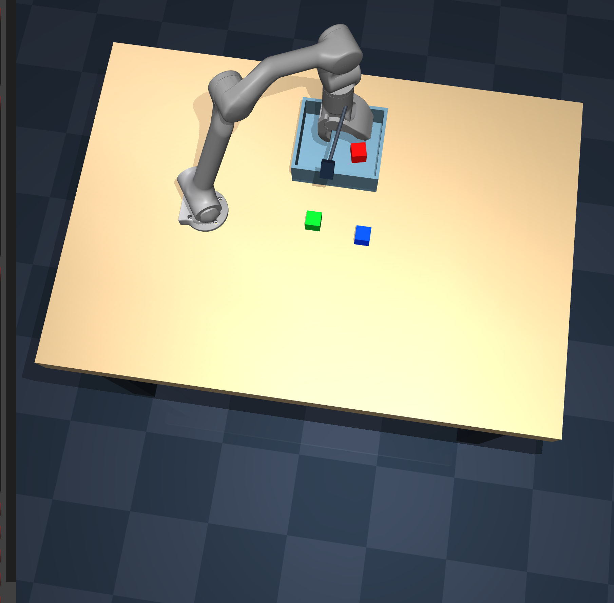
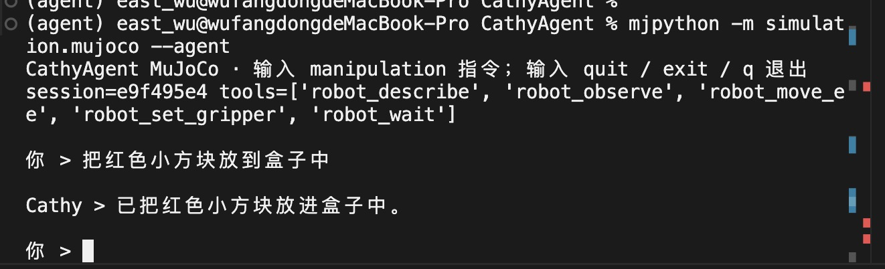

# CathyAgent MuJoCo Runtime

## 结论

第一版采用“CathyAgent 主导、多轮工具调用、MuJoCo 同进程运行”的架构。环境基于 RobotTest 的 Unitree Z1 三色方块物理抓取场景，不使用 UR5，也不要求 CathyAgent 核心维护 action chunk。

## 核心特性

- **Agent 主导闭环**：CathyAgent 维护任务上下文，按照“观察 → 单步动作 → 执行反馈 → 再观察”持续驱动 MuJoCo，而不是由仿真循环反向调用 Agent。
- **VLM 末端位姿控制**：`robot_move_ee` 接收单个 TCP 目标点和可选四元数；IK、轨迹插值、关节控制和物理步进由本地控制器完成，不要求模型输出 action chunk。
- **动态环境发现**：Agent 可通过 `robot_describe` 获取 `base_frame`、workspace、相机、控制频率、单位和夹爪约定，无需把仿真参数硬编码进模型接口。
- **多模态观测**：`robot_observe` 返回关节/TCP 状态、相机标定及 RGB 图像；图像以 SHA-256 Artifact 持久化，并可继续作为模型上下文使用。
- **实时图形 Viewer**：创建 Runtime 时自动打开 MuJoCo 被动 Viewer；状态修改使用 Viewer lock，每个控制周期结束后同步画面。
- **异步串行 Runtime**：MuJoCo `model/data` 由独占线程持有，Agent 工具通过异步队列调用，支持超时、取消、动作预算和快照编号。
- **流式可观测性**：REPL 实时打印模型文本、工具参数、工具结果、耗时和图像 Artifact ID；完整事件同时写入 `outputs/sessions.db`。
- **配置与核心解耦**：环境 YAML、机器人/控制器/观测配置、MJCF、网格、截图、测试和输出均位于 `simulation/mujoco/`，不侵占 CathyAgent 主配置目录。
- **物理抓取回归**：内置 Unitree Z1 红、蓝、绿三色方块抓取放置场景，并使用真实接触进行连续物理回归。
- **评测状态隔离**：物体真值和容器判定只存在于 `evaluation.py`，不注册为 Agent 工具，避免策略读取特权仿真状态。

## 效果展示

### Z1 三色方块抓取仿真



MuJoCo Viewer 会随 Runtime 创建，并实时同步机械臂、夹爪、方块和容器的物理状态。

### CathyAgent 指令驱动



通过 `mjpython -m simulation.mujoco --agent` 启动后，可以直接使用中文或英文 manipulation 指令驱动机器人；模型通过多轮工具调用完成观察、移动、抓取、放置和结果验证。

## 架构

```text
用户指令
  -> CathyAgent Agent loop
     -> robot_describe / robot_observe / robot_move_ee / robot_set_gripper / robot_wait
        -> MujocoToolPlugin
           -> MujocoRuntime（队列 + 独占线程，唯一持有 model/data）
              -> MujocoBackend（MJCF、step、状态校验）
              -> Z1Controller（末端位姿 -> IK -> 50 Hz 关节控制）
              -> Z1ObservationProvider（状态、相机标定、RGB Artifact）
              -> MujocoViewer（创建环境时打开，随控制步同步）
```

职责边界：

- `CathyAgent`：模型调用、上下文、工具循环、会话与 ToolResult 持久化。
- `MujocoToolPlugin`：把稳定的机器人语义翻译为 Runtime 命令。
- `MujocoRuntime`：串行化命令、超时/取消、episode 预算、快照编号。
- `Backend/Controller/Observation`：具体 MuJoCo 实现。
- `evaluation.py`：特权状态与确定性物理回归，仅供测试，绝不注册成 Agent 工具。

同进程不代表模型直接操作 Python 对象。Agent 仍通过 JSON Schema 工具调用；插件将命令送进 Runtime 的独占线程，动作完成后再把结构化结果和图像 Artifact 返回给 Agent。这样既避免 `MjData` 并发访问，也允许 Agent 在每个动作后重新观察并保持多轮上下文。

## 目录

```text
simulation/mujoco/
├── configs/                 # 环境、机器人、控制器、观测配置
├── assets/                  # Z1 MJCF、网格和三色方块场景
├── docs/images/             # README 效果截图
├── tests/                   # 模块级测试与物理回归
├── outputs/                 # 会话、图像 Artifact（git ignored）
├── backend.py               # MuJoCo model/data 边界
├── controller.py            # Z1 IK 与控制
├── observation.py           # 相机/本体观测
├── runtime.py               # 独占线程与异步命令
├── plugin.py / plugin.yaml  # CathyAgent 工具适配
├── agent_runtime.py         # 独立 Agent 装配入口
└── evaluation.py            # 非工具化的特权评分器
```

## 安装与运行

```bash
python -m pip install -r simulation/mujoco/requirements.txt

# macOS 必须使用 mjpython 才能打开被动 Viewer
mjpython -m simulation.mujoco --describe

# 无渲染状态观测（适合 CI/headless）
python -m simulation.mujoco --observe --no-viewer

# 单色或三色物理回归；评分器不暴露给 Agent
mjpython -m simulation.mujoco --scripted red
mjpython -m simulation.mujoco --scripted all

# 使用 CathyAgent 配置中的 LLM 启动多轮操作
mjpython -m simulation.mujoco --agent

# 测试
python -m unittest discover -s simulation/mujoco/tests -v
```

Agent REPL 会实时打印模型文本、每次工具调用的参数、结构化工具结果、耗时和图像 Artifact ID；完整事件仍同时持久化到 `outputs/sessions.db`。

默认环境配置 `runtime.viewer.enabled: true`，创建 Runtime 后立即打开被动 Viewer；物理状态修改持有 Viewer lock，每个 50 Hz 控制步完成后调用 `sync()`，关闭 Runtime 时窗口也会关闭。macOS 必须通过 `mjpython` 启动；CI 或纯 headless 环境传 `--no-viewer`。离屏 RGB 在无 GPU 的 Linux 上可按 [MuJoCo Python 文档](https://mujoco.readthedocs.io/en/stable/python.html) 配置 EGL/OSMesa。

## 工具契约

- `robot_describe()`：动态返回 frame、workspace、相机、频率和单位。
- `robot_observe(cameras?, render?)`：返回本体状态、标定和 RGB Artifact，不泄露物体真值。
- `robot_move_ee(frame, position, quaternion_wxyz?, duration_seconds?)`：一个末端目标点，不是 action chunk。
- `robot_set_gripper(opening)`：`0` 闭合，`1` 张开。
- `robot_wait(sim_seconds)`：保持命令并推进仿真时间，不做墙钟 sleep。

Workspace 是安全包围盒，不代表盒内每个点在给定姿态下都满足 IK；不可达目标会返回 `ik_failed`，Agent 应重新观察并选择中间点。

## 配置与扩展

默认入口是 `configs/environments/z1_three_cube.yaml`，它组合：

- `configs/robots/unitree_z1.yaml`
- `configs/controllers/z1_differential_ik.yaml`
- `configs/observations/z1_three_camera.yaml`
- `assets/z1_pick_place/scene.xml`

新增场景时复制环境 YAML 并引用新的 MJCF；新增机器人时实现对应 Controller/Observation Provider，再由 Factory 选择实现。所有资源路径被限制在 `simulation/mujoco/` 内，避免侵占主配置目录。

## 数据与后续训练

Agent 会话、模型消息、工具调用和 ToolResult 进入 `outputs/sessions.db`；图像按 SHA-256 存在 `outputs/artifacts/`。后续 ego SFT/RL 数据导出应从这些运行事实构建，不在 Runtime 内耦合 Qwen、slime 或 TITO。

## 来源与许可证

场景迁移自本地 RobotTest 的 Z1 三色方块实现。机器人模型源自 [MuJoCo Menagerie Unitree Z1](https://github.com/google-deepmind/mujoco_menagerie/tree/main/unitree_z1)，原始模型许可证保留在 `assets/unitree_z1/LICENSE`；MuJoCo 使用方式参考[官方文档](https://mujoco.readthedocs.io/en/stable/)。

## 总结

这一模块把“Agent 决策”和“仿真执行”隔离开：CathyAgent 控制多轮上下文，MuJoCo 只通过有限、可验证的机器人工具被驱动，配置、资产、测试和数据均在 `simulation/` 内自包含。
